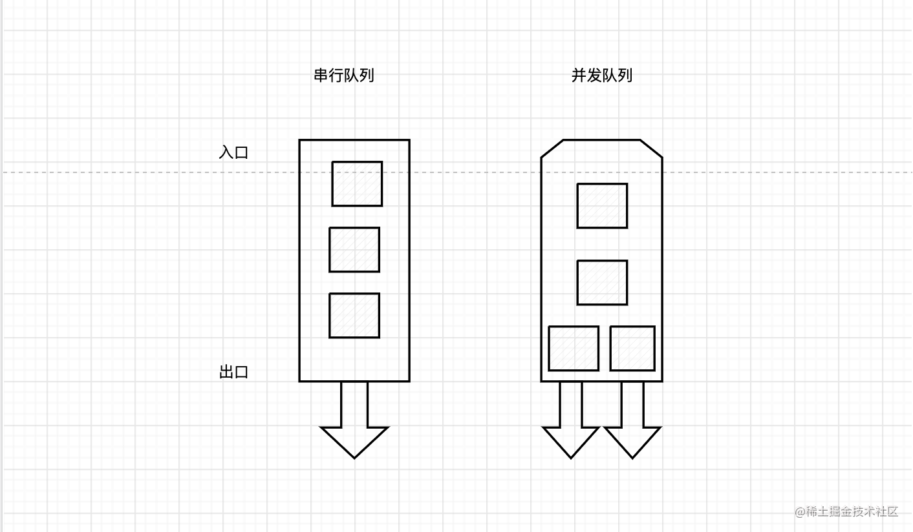
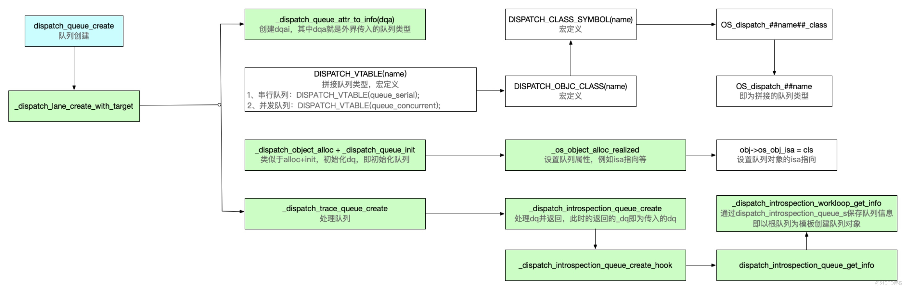
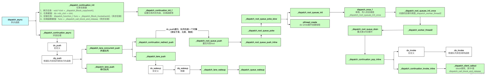
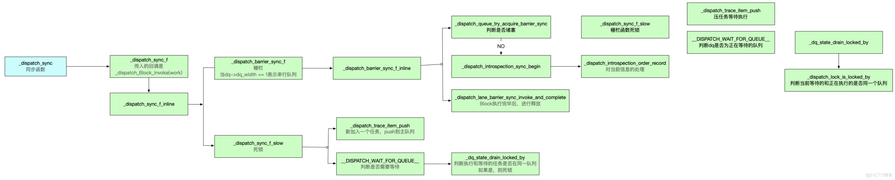

# Dispatch

## dispatch_queue_create

```objective-c
dispatch_queue_t dispatch_queue_create(const char *label, dispatch_queue_attr_t attr);
```

**Discussion**

Blocks submitted to a serial queue are executed one at a time in FIFO order. Note, however, that blocks submitted to independent queues may be executed concurrently with respect to each other. Blocks submitted to a concurrent queue are dequeued in FIFO order but may run concurrently if resources are available to do so.
If your app isn’t using ARC, you should call dispatch_release on a dispatch queue when it’s no longer needed. Any pending blocks submitted to a queue hold a reference to that queue, so the queue is not deallocated until all pending blocks have completed.

提交到串行队列的块按 FIFO 顺序一次执行一个。 但是请注意，提交到独立队列的块可以相对于彼此同时执行。 提交到并发队列的块按 FIFO 顺序出列，但如果资源可用，则可以同时运行。
如果您的应用程序没有使用 ARC，您应该在不再需要时在调度队列上调用 dispatch_release。 任何提交到队列的未决块都持有对该队列的引用，因此在所有未决块完成之前不会释放队列。






**DISPATCH_QUEUE_SERIAL**
A dispatch queue that executes blocks serially in FIFO order.
以 FIFO 顺序串行执行块的调度队列。

**DISPATCH_QUEUE_CONCURRENT**

A dispatch queue that executes blocks concurrently.
并发执行块的调度队列。

Although they execute blocks concurrently, you can use barrier blocks to create synchronization points within the queue.
尽管它们同时执行块，但您可以使用屏障块在队列中创建同步点。

## dispatch_async  

Submits a block for asynchronous execution on a dispatch queue and returns immediately.
提交一个块以在调度队列上异步执行并立即返回。

**Declaration**

```objective-c
void dispatch_async(dispatch_queue_t queue, dispatch_block_t block);
```

**Parameters**

`queue:` The queue on which to submit the block. The system retains the queue until the block runs to completion. This parameter cannot be NULL.
提交块的队列。 系统保留队列，直到块运行完成。 此参数不能为 NULL。

`block:` The block to submit to the target dispatch queue. This function performs Block_copy and Block_release on behalf of callers. This parameter cannot be NULL.
要提交到目标调度队列的块。 该函数代表调用者执行 Block_copy 和 Block_release。 此参数不能为 NULL。



**Discussion**

This function is the fundamental mechanism for submitting blocks to a dispatch queue. Calls to this function always return immediately after the block is submitted and never wait for the block to be invoked. The target queue determines whether the block is invoked serially or concurrently with respect to other blocks submitted to that same queue. Independent serial queues are processed concurrently with respect to each other.
此函数是将块提交到调度队列的基本机制。 对该函数的调用总是在提交块后立即返回，并且永远不会等待调用块。 目标队列确定该块是串行调用还是与提交到同一队列的其他块并发调用。 独立的串行队列相对于彼此同时处理。


## dispatch_sync

Submits a block object for execution and returns after that block finishes executing.
提交要执行的块对象，并在该块完成执行后返回。

**Declaration**

```objective-c
void dispatch_sync(dispatch_queue_t queue, dispatch_block_t block);
```

`queue:` The queue on which to submit the block. This parameter cannot be NULL.
 提交块的队列。 此参数不能为 NULL。

`block:` The block that contains the work to perform. This block has no return value and no parameters. This parameter cannot be NULL.
包含要执行的工作的块。 这个块没有返回值，也没有参数。 此参数不能为 NULL。

**Discussion**

This function submits a block to the specified dispatch queue for synchronous execution. Unlike [dispatch_async](##dispatch_async), this function does not return until the block has finished. Calling this function and targeting the current queue results in deadlock.
Unlike with dispatch_async, no retain is performed on the target queue. Because calls to this function are synchronous, it "borrows" the reference of the caller. Moreover, no Block_copy is performed on the block.
As a performance optimization, this function executes blocks on the current thread whenever possible, with one exception: Blocks submitted to the main dispatch queue always run on the main thread.

该函数将一个块提交到指定的调度队列以同步执行。 与 [dispatch_async](##dispatch_async) 不同，此函数在块完成之前不会返回。 调用此函数并以当前队列为目标会导致死锁。
与 dispatch_async 不同，目标队列不执行保留。 因为对该函数的调用是同步的，所以它“借用”了调用者的引用。 此外，不会对块执行 Block_copy。
作为性能优化，此函数尽可能在当前线程上执行块，但有一个例外：提交到主调度队列的块总是在主线程上运行。



## Quality of Service Classes: 服务质量

主要是4个

<!-- |  表头   | 表头  |
|  ----  | ----  |
| User Interactive  | 单元格 |
| User Initiated | 单元格 | -->
| name | ds |
| ---- | ---- |
| User Interactive(UI) | Is this work aMctaivineltyhirnevaodl,vaendiminautipodnasting the UI? |
| User Initiated(IN) | IsthisworkrequiIrmedmteodciaotnetirneusueltusserinteraction? |
| Utility(UT) | Is the user awaLroenogf-truhnenpirnoggtraeskssof this work? |
| Background(BG) |  Is the user unaware of this work? |

> 服务质量类别被设计成 一个抽象参数你们可以使用 这个参数描述任务的目的和类别 不要试图调整所有 具体的配置值 你们要明白自己所做的都 “由将要执行工作的用户启动” 而系统将自动为平台和设备 选择正确的配置值

> 我前面提到过我们有四个服务质量类别 接下来我要对它们进行简要介绍 它们分别有什么用途 第一个是用户交互模式 这是主线程 假设有一个iOS应用程序用户的手指 正在屏幕上拖动 主线程需要响应以便在 用户手指拖动时交付 下一帧动画 主要用户交互代码是保持动画 以每秒60帧的 速度平稳运行的专门代码

> 所以你们需要问自己 这项工作是否积极参与 到更新UI之中 在决定是否需要进行用户交互式设计时 这一点一定要加以考虑 这不是在加载可能成为滚动视图的内容 这就是在画新的动画 我们所说的用户发起模式 是指加载由用户 完成的动作结果 比如当我翻动滚动视图 为下一个单元加载数据时 或我在使用照片或邮件 应用程序并点击电子邮件或照片 加载全尺寸照片或电子邮件时 这些行为就是我们 所说的用户发起的动作

> 问题是要继续进行用户交互 是否需要这项工作 对其中任何一个都没有帮助 作为用户发起而不是用户拦截 如果用户不能通过你们的应用程序继续 取得有意义的进展 就应该选择用户发起模式

> 效用是指用户本来可能已经开始进行 或已经自动启动任务 这些任务长时间运行但是并不阻碍用户 继续使用你们的应用程序

> 你们要问问自己用户是否了解 这项工作的进展 如果一个杂志app正在下载新刊物 那么用户可以继续使这个app 下载任务可以同时进行彼此互不干扰 他们可以阅读往期刊物或随意浏览 你们可以设计一个进度条 帮助用户了解进展情况 效用是一个很好的类别

> 最后其余的一切都可以归为背景 用户不会主动关注的一切 任何类型的维护任务 清理工作

> 数据库清空都属于背景

> 根本问题是 用户有没有意识到这项工作 背景工作很有趣 因为你要 考虑何时处理背景 我强烈建议你们去看一看

> 去年关于编写节能代码的那部分演讲 该演讲讨论了如何有效地做好背景工作 如何判断你们 的应用程序背景是否表现出色

## block qos

通过服务等级质量被指定到队列上 得到了异步分派的自动传播 用户再次从主流程启动 我们实际上忽略了传播的价值 因为你正在提交 一个自身拥用指定服务等级质量的队列 并说可以用此队列来替代 所以你提交的模块将在后台运行 代替已经如果有的 自动系统 对于这样的情况 某处有一个与执行流程无关的维护任务 考虑调度程序块分离 的标记是否有用是合适的 这是一种告诉操纵系统 你正对这个程序块所做的事情 与执行流程无关的方式 而且它尤其不参与QoS的传播 也不捕捉事物 如活动ID 如果你正在去年我们会上介绍过的 活动追踪特性中使用它

和其它一些执行上下文的性质

当然即使你有工作 它总是应该在QoS背景里 那是些清理性的工作 是可例外的 如一些退出特性 用户退出他的账户 你应该删除数据库 及用户的私人数据 那是一些用户希望能看到它完成的事情 这不该是后台任务 你有必要在后台属性中重写 或退出你这里已经设置过的 这个队列或这个运行 如果这里你仅用自动传播特性 像以前一样除了这里 我们应该忽略 用户初始的QoS 当然这是可用的合适的QoS 这是我们真正期望的 用户正在等待这个退出结束 如何达成呢？ 利用调度程序块执行QoS分类标志 程序块创建和你想执行的程序块 那是在告诉系统 你真的希望程序块中的数值 与队列中的相反 这样你可以重写队列的数值显示

如果你这样做程序块将在本例中 用户初始的QoS分类中执行

但是 当然 在图中 你可以看到现在的情况： 你有个别潜在含两个程序块的队列 两程序块是同时的且有不同的优先级别 这就是异步优先级反转翻转 一个高级QoS程序块 可能被提交给一个串行队列 但是队列中已有工作 或在更低级的QoS中运行 你有优先权翻转

GCD会帮助你如果你通过提升 串行队列中的工作来使用串行队列 运行或是入队 直到你达到高级别的QoS程序块 这是后台QoS覆盖出现问题 并非重写块调用自身的问题 或者如果将任务非同步传输下去 程序块将以原始QoS状态传输 但程序块将以更高优先级 执行从而消除块的反转执行

概括说QoS队列排序大多适合那些 在应用程序中排序是唯一用途的场景 或者输入的指令 不需要考虑登录优先级的重要性 而需要考虑的是指令用途的优先级 QoS队列排序还可用于 为这种类型的工作 负载所开发的独立的程序块API 当这种负载处于维护或后台模式时

在队列中使用QoS会使我们忽略 异步block(块)中的QoS除非 我们在程序中使用强制执行标记

最后是利用串行队列 实现lock(锁)的功能 这在GCD当中是很常见的用法 在程序当中你有一些共享的数据结构 而你想要锁定对这些数据结构的访问 你可以通过 在数据结构中创建一个带有调用队列 标记的串行队列的方法来使用GCD 然后用同步调用来执行关键的区段块 在队列中只有这个block（块） 有访问数据结构的权限

QoS在这个过程中是如何运行的呢 注明”同步调用”函数很重要 当调用”同步调用”函数的线程 被锁定时执行块 返回block（块）的同时释放线程 这种情况下我们不需要任何额外的线程 我们只需要执行调用同步调用的线程 然后在所调用线程的QoS中执行块 此处指用户交互进程 当你可以使用同步 因为有其他的线程或队列 也在访问此数据结构 或许当执行一个QoS线程时 在队列内调用”同步调用”函数 从而可以独占访问 数据结构 如果随后返回线程 同样的事情将出现 他将停止等待线程以获取独占访问权限 然后在调用QoS的线程中 执行自身 QoS线程中的块

我们就又会碰到 如果这个独占访问以别的顺序获得 优先权翻转的问题 如果实用程序效用先进入锁死 主线程就必须等待效用线程 这当然是我们不期望的 所以QoS继承 异步优先级翻转会帮助你去解决 一个高级的优先级服务线程正在等待 较低级别的进程工作 我们可以通过为等待期间 提高等待工作的QoS来解决 如果你用串行队列和同步调用 或调用程序块等待API 如果你用多线程互斥锁 或任何建立在其上的API 如NSLock也可实现

值得注意的是 有些API在这里是不可用的 调度信号量不承认认同所有权概念 所以系统无法决定 谁最终将向信号量发信号 那种情况下 没有任何优先权翻转的解决方案 如果你有优先级翻转 你在某调度信号 等待中发现高级优先级等待者 低级别优先级工作者正在执行某些工作 你可能必须转变成调度程序块等待 在我们能够进行提升的外显实体处等待


## 宏分析
```c
__builtin_expect   //__builtin_expect的第一个参数是实际值，第二个参数是预测值。使用这个目的是告诉编译器if条件式是不是有更大的可能被满足。
#define likely(x) __builtin_expect(!!(x), 1) // likely表示更大可能成立 if(likely(a == 0))理解成if(a==0)即可
#define unlikely(x) __builtin_expect(!!(x), 0) // unlikely表示更大可能不成立

#define fastpath(x) ((typeof(x))__builtin_expect(_safe_cast_to_long(x), ~0l)) //fastpath表示更大可能成立
#define slowpath(x) ((typeof(x))__builtin_expect(_safe_cast_to_long(x), 0l)) //slowpath表示更大可能不成立
```

**当dispatch_sync + 串行队列的时候，这个串行队列就会对应一个线程，如果添加任务的代码执行的线程，和串行队列所对应的线程是一个线程的时候，就会发生死锁，从而crash。**


**所以想要满足"同一时间多读单写"的读写锁,方案只有pthread_rwlock/dispatch_barrier_async, 普通的锁无法满足要求.**