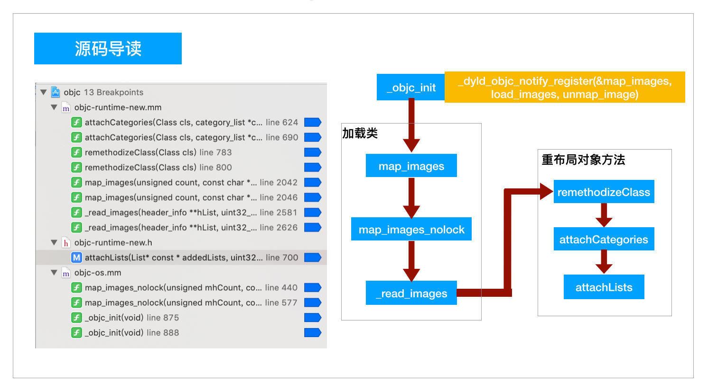

# Runtime 原理


## isa指针


```c++
// MARK: - isa_t 用位的方式 存储类的描述信息
union isa_t {
    isa_t() { }
    isa_t(uintptr_t value) : bits(value) { }

    uintptr_t bits;

private:
    // Accessing the class requires custom ptrauth operations, so
    // force clients to go through setClass/getClass by making this
    // private.
    Class cls;

public:
#if defined(ISA_BITFIELD)
    // struct {
    //    uintptr_t nonpointer        : 1;                                          \
    //     0 表示普通的 isa 指针，1 表示使用优化，存储引用计数
    //    uintptr_t has_assoc         : 1;                                         \
    //     表示该对象是否包含 associated object，如果没有，则析构时会更快
    //    uintptr_t has_cxx_dtor      : 1;                                         \
    //     表示该对象是否有 C++ 或 ARC 的析构函数，如果没有，则析构时更快
    //    uintptr_t shiftcls          : 44; /*MACH_VM_MAX_ADDRESS 0x7fffffe00000*/ \
    //     类的指针
    //    uintptr_t magic             : 6;                                         \
    //     固定值为 0xd2，用于在调试时分辨对象是否未完成初始化。
    //    uintptr_t weakly_referenced : 1;                                         \
    //     表示该对象是否有过 weak 对象，如果没有，则析构时更快
    //    uintptr_t unused            : 1;                                         \
        
    //    uintptr_t has_sidetable_rc  : 1;                                         \
    //     表示该对象的引用计数值是否过大无法存储在 isa 指针
    //    uintptr_t extra_rc          : 8
    //     存储引用计数值减一后的结果
        
    //     // ISA_BITFIELD;  // defined in isa.h
    // };

    bool isDeallocating() {
        return extra_rc == 0 && has_sidetable_rc == 0;
    }
    void setDeallocating() {
        extra_rc = 0;
        has_sidetable_rc = 0;
    }
#endif

    void setClass(Class cls, objc_object *obj);
    Class getClass(bool authenticated);
    Class getDecodedClass(bool authenticated);
};

// MARK: objc_object - 只有一个isa 成员
struct objc_object {
    isa_t isa;
}

struct class_rw_ext_t {
    DECLARE_AUTHED_PTR_TEMPLATE(class_ro_t)
    class_ro_t_authed_ptr<const class_ro_t> ro; // class_ro_t
    method_array_t methods;      // 方法列表
    property_array_t properties; // 属性列表
    protocol_array_t protocols;  // 协议列表
    char *demangledName;
    uint32_t version;
};

// MARK: - 提供了运行时对类拓展的能力。内容可以在运行时被动态修改的，可以说运行时对类的拓展大都是存储在这里的。（比如：分类） readwrite 类型
struct class_rw_t {
    // Be warned that Symbolication knows the layout of this structure.
    uint32_t flags;
    uint16_t witness;
#if SUPPORT_INDEXED_ISA
    uint16_t index;
#endif

    // class_rw_ext_t*
    explicit_atomic<uintptr_t> ro_or_rw_ext;

    Class firstSubclass;
    Class nextSiblingClass;


    class_rw_ext_t *extAllocIfNeeded() {
        auto v = get_ro_or_rwe();
        if (fastpath(v.is<class_rw_ext_t *>())) {
            return v.get<class_rw_ext_t *>(&ro_or_rw_ext);
        } else {
            return extAlloc(v.get<const class_ro_t *>(&ro_or_rw_ext));
        }
    }

};


// MARK: - class_data_bits_t
struct class_data_bits_t {
    friend objc_class;

    // Values are the FAST_ flags above.
    uintptr_t bits;
public:

    // MARK: class_rw_t* data() => return (class_rw_t *)(bits & FAST_DATA_MASK);
    class_rw_t* data() const {
        return (class_rw_t *)(bits & FAST_DATA_MASK);
    }

};

struct objc_class : objc_object {
  objc_class(const objc_class&) = delete;
  objc_class(objc_class&&) = delete;
  void operator=(const objc_class&) = delete;
  void operator=(objc_class&&) = delete;
    // Class ISA; - objc_object
    Class superclass;
    cache_t cache;             // formerly cache pointer and vtable
    
    class_data_bits_t bits;    // class_rw_t * plus custom rr/alloc flags
    // 这个属性存储了 属性 方法 协议
}
```


## 分类



<!--  -->


## load

`+ (void)load(void)`

runtime 启动调用 
[void _objc_init(void)](objc4/runtime/objc-os.mm) 
-> `_dyld_objc_notify_register(&map_images, load_images, unmap_image);`  
-> [void load_images(const char *path __unused, const struct mach_header *mh)](objc4/runtime/objc-runtime-new.mm)
-> [static void loadAllCategories()](objc4/runtime/objc-runtime-new.mm)
-> [void prepare_load_methods(const headerType *mhdr)](objc4/runtime/objc-runtime-new.mm)
-> [static void schedule_class_load(Class cls)](objc4/runtime/objc-runtime-new.mm)
-> `schedule_class_load(cls->getSuperclass());` -> `add_class_to_loadable_list(cls);`
-> [void call_load_methods(void)](objc4/runtime/objc-loadmethod.mm)
-> [static void call_class_loads(void)](objc4/runtime/objc-loadmethod.mm)
-> [static bool call_category_loads(void)](objc4/runtime/objc-loadmethod.mm)

总结load方法调用顺序

1.先调用类的load方法

按照编译先后顺序调用(先编译，先调用)
调用子类的load方法之前会先调用父类的load方法
2.再调用分类的load方法

按照编译先后顺序，先编译，先调用

- 源码调用顺序


## initialize

`+ (void)initialize(void)`

- initialize方法的调用时机
    - initialize在类第一次接收到消息时调用，也就是objc_msgSend()。
    - 先调用父类的+initialize，再调用子类的initialize。


load 方法是通过函数指针调用
initialize 方法是通过消息发送调用

1. 查看本类的initialize方法有没有实现过，如果已经实现过就返回，不再实现。
2. 如果本类没有实现过initialize方法，那么就去递归查看该类的父类有没有实现过initialize方法，如果没有实现就去实现，最后实现本类的initialize方法。并且initialize方法是通过objc_msgSend()实现的。


## 内存管理

[内存管理](https://www.jianshu.com/p/e0d49b3d4fd3)

### Side Table


### 创建对象

objc_alloc_init

```c++
// NSObject.mm
static ALWAYS_INLINE id
callAlloc(Class cls, bool checkNil, bool allocWithZone=false)
{
#if 1
    if (slowpath(checkNil && !cls)) return nil;
    if (fastpath(!cls->ISA()->hasCustomAWZ())) {
        return _objc_rootAllocWithZone(cls, nil);
    }
#endif

    // No shortcuts available.
    if (allocWithZone) {
        return ((id(*)(id, SEL, struct _NSZone *))objc_msgSend)(cls, @selector(allocWithZone:), nil);
    }
    return ((id(*)(id, SEL))objc_msgSend)(cls, @selector(alloc));
}

// objc-class-old.mm
id
_objc_rootAllocWithZone(Class cls, malloc_zone_t *zone)
{
    id obj;

    if (fastpath(!zone)) {
        obj = class_createInstance(cls, 0);
    } else {
        obj = class_createInstanceFromZone(cls, 0, zone);
    }

    if (slowpath(!obj)) obj = _objc_callBadAllocHandler(cls);
    return obj;
}

// objc-class-old.mm
id class_createInstance(Class cls, size_t extraBytes)
{
    return (*_alloc)(cls, extraBytes);
}

id(*badAllocHandler)(Class) = &defaultBadAllocHandler;

// NSObject.mm
id _objc_callBadAllocHandler(Class cls)
{
    // fixme add re-entrancy protection in case allocation fails inside handler
    return (*badAllocHandler)(cls);
}

```

_objc_rootAllocWithZone

### 查看引用计数

```c++

- (NSUInteger)retainCount {
    return _objc_rootRetainCount(self);
}

uintptr_t
_objc_rootRetainCount(id obj)
{
    ASSERT(obj);

    return obj->rootRetainCount();
}


inline uintptr_t 
objc_object::rootRetainCount()
{
    // 如果是 Tagged Pointer 直接返回
    if (isTaggedPointer()) return (uintptr_t)this;

    sidetable_lock();
    
    isa_t bits = __c11_atomic_load((_Atomic uintptr_t *)&isa.bits, __ATOMIC_RELAXED);
    
    if (bits.nonpointer) {
        // 2. 获取引用计数
        uintptr_t rc = bits.extra_rc;
        if (bits.has_sidetable_rc) {
            // 如果 Side Table还有存储 则取出累加返回
            rc += sidetable_getExtraRC_nolock();
        }
        sidetable_unlock();
        return rc;
    }

    sidetable_unlock();
    
    return sidetable_retainCount();
}

uintptr_t
objc_object::sidetable_retainCount()
{
    // 全局引用计数管理 tables
    SideTable& table = SideTables()[this];

    size_t refcnt_result = 1;
    
    table.lock();
    
    // 找到 找到引用管理map
    RefcountMap::iterator it = table.refcnts.find(this);
    
    if (it != table.refcnts.end()) {
        // 找到引用计数
        // this is valid for SIDE_TABLE_RC_PINNED too
        refcnt_result += it->second >> SIDE_TABLE_RC_SHIFT;
    }
    table.unlock();
    return refcnt_result;
}

```

### 增加引用计数

```c++
// NSObject.mm
void
objc_storeStrong(id *location, id obj)
{
    id prev = *location;
    if (obj == prev) {
        return;
    }
    objc_retain(obj);
    *location = obj;
    objc_release(prev);
}

// NSObject.mm
id objc_retain(id obj) { 
    return [obj retain]; 
}

// NSObject.mm
- (id)retain {
    return _objc_rootRetain(self);
}

// NSObject.mm
NEVER_INLINE id
_objc_rootRetain(id obj)
{
    ASSERT(obj);

    return obj->rootRetain();
}

//objc-object.h
ALWAYS_INLINE id 
objc_object::rootRetain()
{
    return rootRetain(false, RRVariant::Fast);
}

//objc-object.h
inline id 
objc_object::rootRetain()
{
    if (isTaggedPointer()) return (id)this;
    return sidetable_retain();
}

// objc-object.h
inline id 
objc_object::retain()
{
    ASSERT(!isTaggedPointer());

    return rootRetain(false, RRVariant::FastOrMsgSend);
}

// MARK: 内存引用计数最终调用在这里
ALWAYS_INLINE id
objc_object::rootRetain(bool tryRetain, objc_object::RRVariant variant)
{
    //Tagged Pointer对象直接返回
    if (slowpath(isTaggedPointer())) return (id)this;

    bool sideTableLocked = false;
    //transcribeToSideTable用于表示extra_rc是否溢出，默认为false
    bool transcribeToSideTable = false;

    isa_t oldisa;
    isa_t newisa;

    oldisa = LoadExclusive(&isa.bits);//将isa提取出来

    if (variant == RRVariant::FastOrMsgSend) {
        // These checks are only meaningful for objc_retain()
        // They are here so that we avoid a re-load of the isa.
        // 这些检查只对 objc_retain() 有意义
        // 它们在这里是为了避免重新加载 isa。
        if (slowpath(oldisa.getDecodedClass(false)->hasCustomRR())) {
            ClearExclusive(&isa.bits);
            if (oldisa.getDecodedClass(false)->canCallSwiftRR()) {
                return swiftRetain.load(memory_order_relaxed)((id)this);
            }
            return ((id(*)(objc_object *, SEL))objc_msgSend)(this, @selector(retain));
        }
    }

    if (slowpath(!oldisa.nonpointer)) {
        // a Class is a Class forever, so we can perform this check once
        // outside of the CAS loop
        // 一个类永远是一个类，所以我们可以执行一次这个检查
        // 在 CAS 循环之外
        if (oldisa.getDecodedClass(false)->isMetaClass()) {
            ClearExclusive(&isa.bits);
            return (id)this;
        }
    }

    do {
        transcribeToSideTable = false;
        newisa = oldisa;
        //如果isa没有优化，直接从sideTable中返回引用计数
        if (slowpath(!newisa.nonpointer)) {
            ClearExclusive(&isa.bits);
            if (tryRetain) return sidetable_tryRetain() ? (id)this : nil;
            else return sidetable_retain(sideTableLocked);
        }
        //如果对象正在析构，则直接返回nil
        // don't check newisa.fast_rr; we already called any RR overrides
        // 不检查 newisa.fast_rr; 我们已经调用了任何 RR 覆盖
        if (slowpath(newisa.isDeallocating())) {
            ClearExclusive(&isa.bits);
            if (sideTableLocked) {
                ASSERT(variant == RRVariant::Full);
                sidetable_unlock();
            }
            if (slowpath(tryRetain)) {
                return nil;
            } else {
                return (id)this;
            }
        }
        uintptr_t carry;
        // isa指针中的extra_rc+1；
        newisa.bits = addc(newisa.bits, RC_ONE, 0, &carry);  // extra_rc++

        if (slowpath(carry)) {
            // 有进位，表示溢出，extra_rc已经不能存储在isa指针中了
            // newisa.extra_rc++ overflowed
            
            if (variant != RRVariant::Full) {
                ClearExclusive(&isa.bits);
                return rootRetain_overflow(tryRetain);
            }
            // Leave half of the retain counts inline and 
            // prepare to copy the other half to the side table.
            // 保留一半的保留计数内联和
            // 准备将另一半复制到side table。
            
            /*
                溢出处理
                1.先将extra_rc中引用计数减半，继续存储在isa中
                2.同时把has_sidetable_rc设置为true，表明借用了sideTable存储
                3.将另一半的引用计数，存放在sideTable中
            */
            if (!tryRetain && !sideTableLocked) sidetable_lock();
            sideTableLocked = true;
            transcribeToSideTable = true;
            newisa.extra_rc = RC_HALF;
            newisa.has_sidetable_rc = true;
        }
    } while (slowpath(!StoreExclusive(&isa.bits, &oldisa.bits, newisa.bits)));

    if (variant == RRVariant::Full) {
        if (slowpath(transcribeToSideTable)) {
            // isa的extra_rc溢出，将一半refer count值放到SideTable中
            // Copy the other half of the retain counts to the side table.
            // 将保留计数的另一半复制到边表。
            sidetable_addExtraRC_nolock(RC_HALF);
        }

        if (slowpath(!tryRetain && sideTableLocked)) sidetable_unlock();
    } else {
        ASSERT(!transcribeToSideTable);
        ASSERT(!sideTableLocked);
    }

    return (id)this;
}
```

- Tagged Pointer 对象，没有 retain。
- isa 中 extra_rc 若未溢出，则累加 1。如果溢出，则将 isa 和 side table 对半存储。


### 减少引用计数

```c++

- (oneway void)release {
    _objc_rootRelease(self);
}

NEVER_INLINE void
_objc_rootRelease(id obj)
{
    ASSERT(obj);

    obj->rootRelease();
}


// Base release implementation, ignoring overrides.
// Does not call -dealloc.
// Returns true if the object should now be deallocated.
// This does not check isa.fast_rr; if there is an RR override then 
// it was already called and it chose to call [super release].
// 
// handleUnderflow=false is the frameless fast path.
// handleUnderflow=true is the framed slow path including side table borrow
// The code is structured this way to prevent duplication.
ALWAYS_INLINE bool 
objc_object::rootRelease()
{
    return rootRelease(true, RRVariant::Fast);
}

ALWAYS_INLINE bool
objc_object::rootRelease(bool performDealloc, objc_object::RRVariant variant)
{
    //如果是Tagged Pointer，直接返回false，不需要dealloc
    if (slowpath(isTaggedPointer())) return false;

    bool sideTableLocked = false;

    isa_t newisa, oldisa;

    oldisa = LoadExclusive(&isa.bits);

    if (variant == RRVariant::FastOrMsgSend) {
        // These checks are only meaningful for objc_release()
        // They are here so that we avoid a re-load of the isa.
        // 这些检查只对 objc_release() 有意义
        // 它们在这里是为了避免重新加载 isa。
        if (slowpath(oldisa.getDecodedClass(false)->hasCustomRR())) {
            ClearExclusive(&isa.bits);
            if (oldisa.getDecodedClass(false)->canCallSwiftRR()) {
                swiftRelease.load(memory_order_relaxed)((id)this);
                return true;
            }
            ((void(*)(objc_object *, SEL))objc_msgSend)(this, @selector(release));
            return true;
        }
    }

    if (slowpath(!oldisa.nonpointer)) {
        // a Class is a Class forever, so we can perform this check once
        // outside of the CAS loop
        if (oldisa.getDecodedClass(false)->isMetaClass()) {
            ClearExclusive(&isa.bits);
            return false;
        }
    }

retry:
    do {
        newisa = oldisa;
        //如果isa未优化，直接调用sideTable的release函数
        if (slowpath(!newisa.nonpointer)) {
            ClearExclusive(&isa.bits);
            return sidetable_release(sideTableLocked, performDealloc);
        }
        if (slowpath(newisa.isDeallocating())) {
            ClearExclusive(&isa.bits);
            if (sideTableLocked) {
                ASSERT(variant == RRVariant::Full);
                sidetable_unlock();
            }
            return false;
        }

        // don't check newisa.fast_rr; we already called any RR overrides
        // 不检查 newisa.fast_rr; 我们已经调用了任何 RR 覆盖
        uintptr_t carry;
        //将当前isa指针中存储的引用计数减1，如果未溢出，返回false，不需要dealloc
        newisa.bits = subc(newisa.bits, RC_ONE, 0, &carry);  // extra_rc--
        if (slowpath(carry)) { //减1下导致溢出，则需要从side Table借位，跳转到溢出处理
            // don't ClearExclusive()
            goto underflow;
        }
    } while (slowpath(!StoreReleaseExclusive(&isa.bits, &oldisa.bits, newisa.bits)));

    if (slowpath(newisa.isDeallocating()))
        goto deallocate;

    if (variant == RRVariant::Full) {
        if (slowpath(sideTableLocked)) sidetable_unlock();
    } else {
        ASSERT(!sideTableLocked);
    }
    return false;

 underflow:
    // newisa.extra_rc-- underflowed: borrow from side table or deallocate
    // newisa.extra_rc--下溢：从边表借用或解除分配
    // abandon newisa to undo the decrement
    // 放弃 newisa 以撤销递减
    newisa = oldisa;

    if (slowpath(newisa.has_sidetable_rc)) {
        
        if (variant != RRVariant::Full) {
            ClearExclusive(&isa.bits);
            return rootRelease_underflow(performDealloc);
        }

        // Transfer retain count from side table to inline storage.
        // 将保留计数从边表传输到内联存储。
        if (!sideTableLocked) {
            ClearExclusive(&isa.bits);
            sidetable_lock();
            sideTableLocked = true;
            // Need to start over to avoid a race against 
            // the nonpointer -> raw pointer transition.
            oldisa = LoadExclusive(&isa.bits);
            goto retry;
        }

        // Try to remove some retain counts from the side table.        
        auto borrow = sidetable_subExtraRC_nolock(RC_HALF);

        bool emptySideTable = borrow.remaining == 0; // we'll clear the side table if no refcounts remain there

        //尝试从SideTable中取出，当前isa能存储引用计数最大值的一半的引用计数
        if (borrow.borrowed > 0) {
            // Side table retain count decreased.
            // Try to add them to the inline count.
            // Side table保留计数减少。
            // 尝试将它们添加到内联计数中。
            bool didTransitionToDeallocating = false;
            
            //将取出的引用计数减一，并保存到isa中，保存成功返回false（未被销毁）
            newisa.extra_rc = borrow.borrowed - 1;  // redo the original decrement too
            newisa.has_sidetable_rc = !emptySideTable;

            bool stored = StoreReleaseExclusive(&isa.bits, &oldisa.bits, newisa.bits);

            if (!stored && oldisa.nonpointer) {
                // Inline update failed. 
                // Try it again right now. This prevents livelock on LL/SC 
                // architectures where the side table access itself may have 
                // dropped the reservation.
                
                // 内联更新失败。
                // 现在再试一次。 这可以防止 LL/SC 上的活锁
                // 侧表访问本身可能具有的架构
                // 取消预订。
                
                uintptr_t overflow;
                newisa.bits =
                    addc(oldisa.bits, RC_ONE * (borrow.borrowed-1), 0, &overflow);
                newisa.has_sidetable_rc = !emptySideTable;
                if (!overflow) {
                    stored = StoreReleaseExclusive(&isa.bits, &oldisa.bits, newisa.bits);
                    if (stored) {
                        didTransitionToDeallocating = newisa.isDeallocating();
                    }
                }
            }

            if (!stored) {
                //如果还是失败，则将借出来的一半retain count，重新返回给side Table
                
                // Inline update failed.
                // Put the retains back in the side table.
                // 内联更新失败。
                // 将保留放回side table。
                ClearExclusive(&isa.bits);
                sidetable_addExtraRC_nolock(borrow.borrowed);
                oldisa = LoadExclusive(&isa.bits);
                goto retry;
            }

            // Decrement successful after borrowing from side table.
            if (emptySideTable)
                sidetable_clearExtraRC_nolock();

            if (!didTransitionToDeallocating) {
                if (slowpath(sideTableLocked)) sidetable_unlock();
                return false;
            }
        }
        else {
            // Side table is empty after all. Fall-through to the dealloc path.
        }
    }

deallocate:
    // Really deallocate.

    ASSERT(newisa.isDeallocating());
    ASSERT(isa.isDeallocating());

    if (slowpath(sideTableLocked)) sidetable_unlock();

    __c11_atomic_thread_fence(__ATOMIC_ACQUIRE);
    
    //销毁对象
    if (performDealloc) {
        ((void(*)(objc_object *, SEL))objc_msgSend)(this, @selector(dealloc));
    }
    return true;
}
```


### 释放对象

```c++
- (void)dealloc {
    _objc_rootDealloc(self);
}

inline void
objc_object::rootDealloc()
{
    if (isTaggedPointer()) return;  // fixme necessary?
    
    //如果是优化的isa
    //并且对应的没有关联对象、weak应用、以及c++析构函数和sideTable的引用计数，就直接free掉
    
    if (fastpath(isa.nonpointer                     &&
                 !isa.weakly_referenced             &&
                 !isa.has_assoc                     &&
#if ISA_HAS_CXX_DTOR_BIT
                 !isa.has_cxx_dtor                  &&
#else
                 !isa.getClass(false)->hasCxxDtor() &&
#endif
                 !isa.has_sidetable_rc))
    {
        assert(!sidetable_present());
        // free 释放掉内存
        free(this);
    } 
    else {
        // 销毁流程
        object_dispose((id)this);
    }
}

id 
object_dispose(id obj)
{
    if (!obj) return nil;

    objc_destructInstance(obj);    
    free(obj);

    return nil;
}

void *objc_destructInstance(id obj) 
{
    if (obj) {
        // Read all of the flags at once for performance.
        bool cxx = obj->hasCxxDtor();
        bool assoc = obj->hasAssociatedObjects();

        // This order is important.
        if (cxx) object_cxxDestruct(obj); //C++释放
        // 关联对象
        if (assoc) _object_remove_assocations(obj, /*deallocating*/true);//移除关联对象
        obj->clearDeallocating();//将指向当前的弱指针置为nil
    }

    return obj;
}
```

## KVO - KVC

## 方法替换

## 元类

## 消息传递 消息转发 消息转发机制

动态方法解析

消息接受者重定向

消息重定向


