![TOC]

# 小站配置

## 首次配置

1. 路由器配置: 更改路由器DHCP为`192.168.2.[1 ~ 255]`


2. 网络连接：小站与路由器网线直连。小站网络端口1:`192.168.2.111`
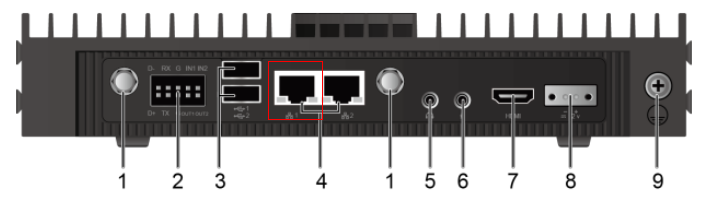

3. 进入web后台： 同一局域网内存访问小站`192.168.2.111`。如果浏览器显示“此网站的安全证书有问题”，请单击“继续浏览此网站”
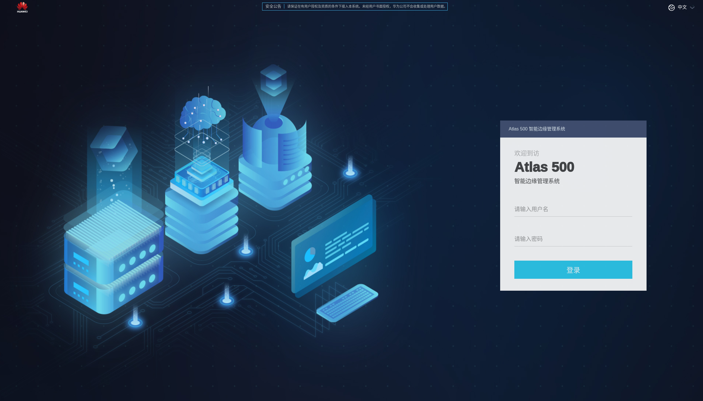

4. 输入用户名和密码: 默认用户名`admin` 默认密码`Huawei12#$`
5. 在弹出的修改窗口中，输入原密码、新密码、确认密码并单击“确定”，完成用户密
码修改。


6. 在登录界面，再次输入用户名和新的密码。

7. 登录进入web系统


### ssh配置

1. `ssh atlas@192.168.2.111`

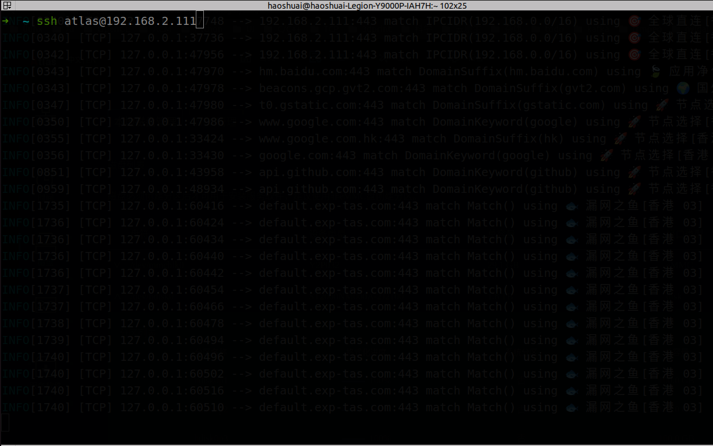

2. 进入 `IES:`命令窗口

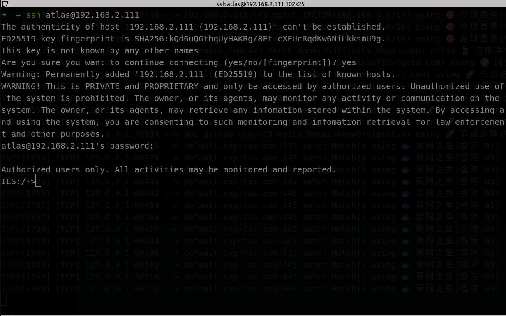

3. 在IES窗口输入`sftp enable`命令开启stfp。


4. 进入开发模式也是以**root**用户进入系统,在IES中输入`develop`命令，会提示输入密码，默认密码:`Huawei@SYS3`。第一次进入会提示修改密码。


5. 进入开发模式后开启**root用户登录**。配置如下


### sftp配置

1. 之前已经开启小站sftp服务。


2. 增加sftp的访问目录`/home/zhonghang`。默认有`/tmp`目录。

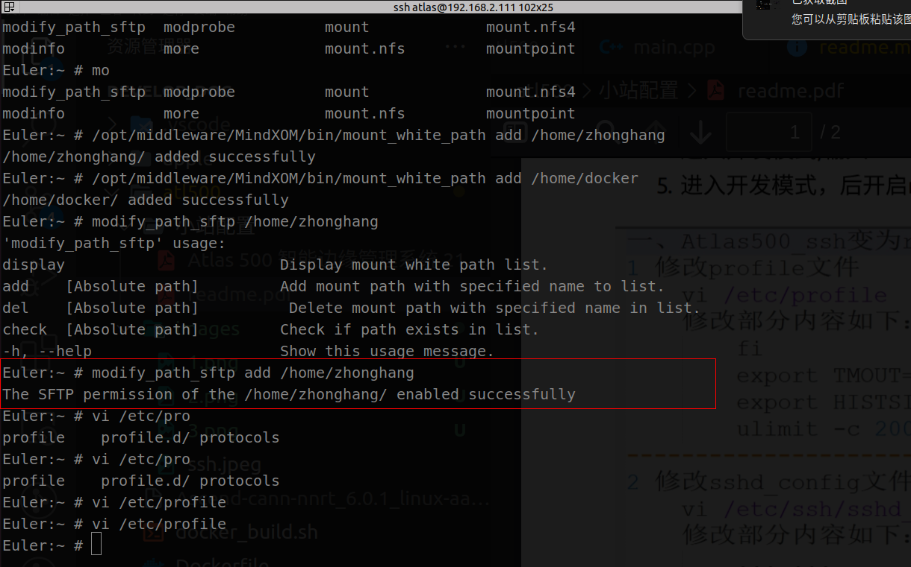

3. 通过sftp客户端链接小站。


4. 将本地的代码文件上传至小站的`/home/zhonghang`目录下。

```sh

sftp root@192.168.2.111

put -r [dir] .
put [file] .
get [file] .
get -r [dir] .

```

- [SFTP文件传输基本命令](https://blog.csdn.net/Trance95/article/details/128735668)

### 网络配置

由于小站默认不开启外网访问，需要开启外网访问需要额外配置。

1. ssh root进入系统

2. 增加dns配置,往`/etc/resolv.conf`文件写入`nameserver 114.114.114.114`


3. 增加网关配置 `route add default gw 192.168.2.1`。**每次重新小站后都要运行此配置**


4. 进行网络测试 `ping www.baidu.com`
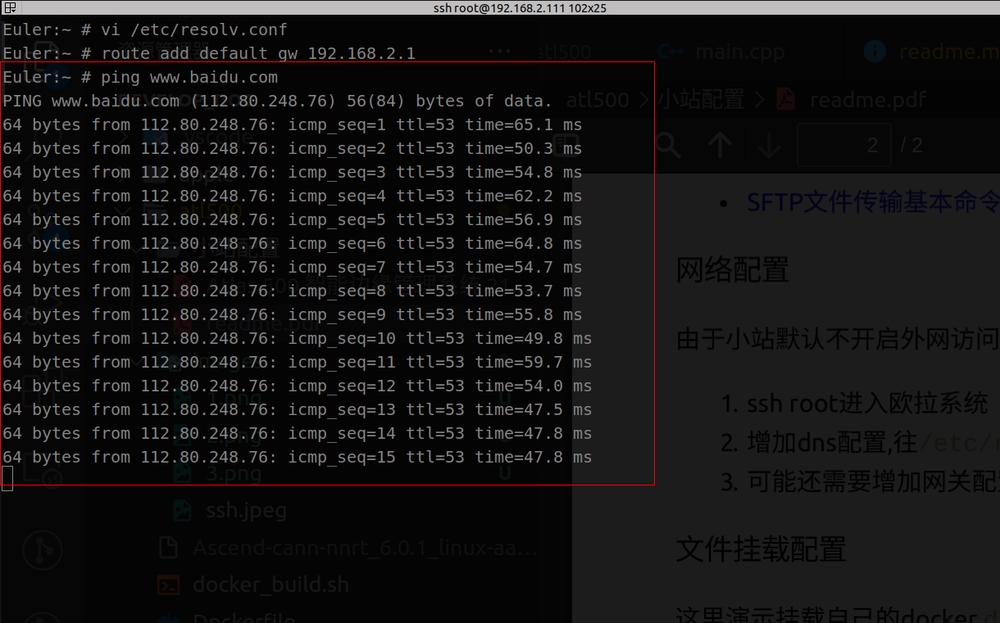


### 文件挂载配置

**由于小站系统的内存很少，我们需要额外挂载磁盘分区。我这里需要挂载了两个分区 `/home/docker`(docker镜像运行目录) `/home/zhonghang`(项目存储目录)**


1. ssh root进入远程命令窗口执行`/opt/middleware/MindXOM/bin/mount_white_path add [path]`命令，将挂载路径手动添加到白名单中

```sh
/opt/middleware/MindXOM/bin/mount_white_path add /home/docker
/opt/middleware/MindXOM/bin/mount_white_path add /home/zhonghang
```
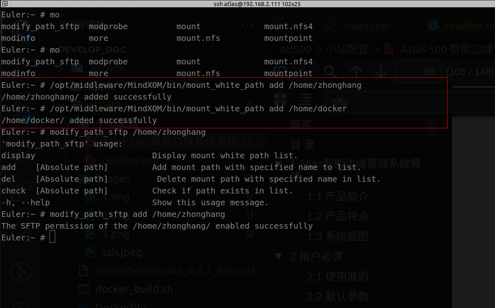

2. 进入web管理后台 -> 管理 -> 磁盘


3. 点击 **/dev/hdisk0** 后面的创建分区


4. 点击后面的**创建分区**, 创建2个100G分区。没有出现新的分区，点击刷新。
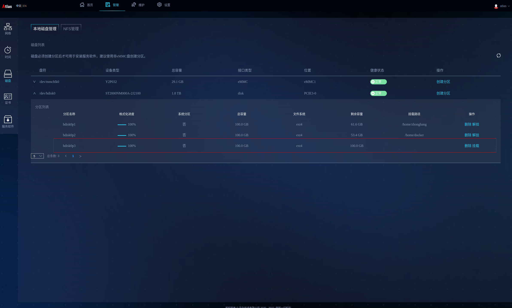

5. 在web管理后台，在刚创建好的分区点击挂载路径

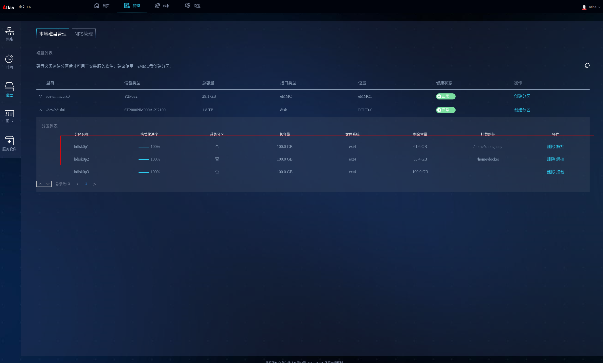

### docker环境配置

由于小站系统的内存很少，需要重新配置docker `data-root`目录。直接用上面创建的目录。

1. ssh root进入远程命令窗口。

2. 在`/etc/docker/daemon.json`增加`"data-root": "/home/docker"`配置。

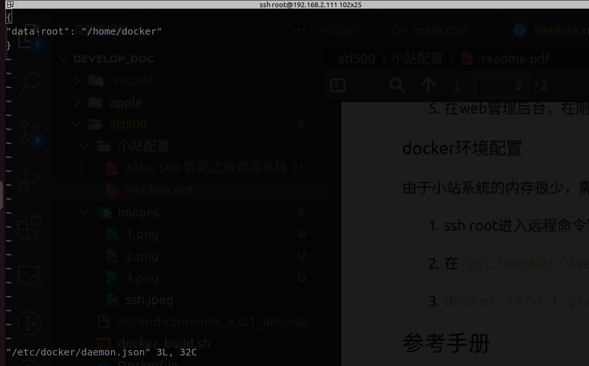

3. `docker info | grep  "Docker Root Dir"` 查看配置是否生效。


----

# 在本地电脑配置开发环境

## 安装 anaconda

1. [下载安装文件](https://www.anaconda.com/download) 

2. 执行安装命令

```sh

chmod +x Anaconda3-2023.07-1-Linux-x86_64.sh

bash Anaconda3-2023.07-1-Linux-x86_64.sh

# 全部选择yes

# 启动命令窗口,不激活base环境
conda config --set auto_activate_base false
```

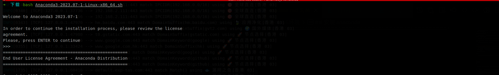

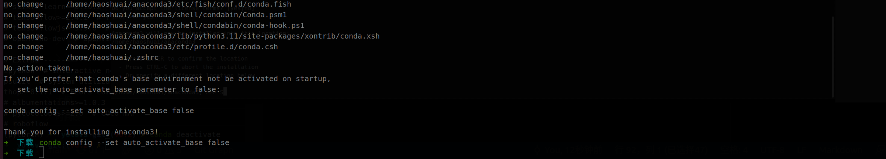

## 配置开发环境

### 配置yolov5 v6.2环境

```sh

# 创建 pytorch 环境
conda create --name ascend python=3.7

# 创建 激活 环境
conda activate ascend

mkdir -p ${HOME}/ascend_soft

cd ${HOME}/ascend_soft

# 克隆yolov5代码
git clone https://github.com/ultralytics/yolov5.git

cd yolov5

# 切换到 v6.2 分支版本
git checkout v6.2

# 安装yolov5运行依赖
pip3 install -r requirements.txt -i https://pypi.tuna.tsinghua.edu.cn/simple

```

### 本地安装开发环境

> 本地安装开发环境只是在代码编写的时候好发现错误

```sh

cd ${HOME}/ascend_soft

# Ascend-cann-toolkit_6.0.1_linux-x86_64.run 在软件包中
chmod +x Ascend-cann-toolkit_6.0.1_linux-x86_64.run

# 校验软件包安装文件的一致性和完整性
./Ascend-cann-toolkit_6.0.1_linux-x86_64.run --check

# 安装软件
./Ascend-cann-toolkit_6.0.1_linux-x86_64.run --install

```

### 在非昇腾设备上安装开发依赖包(这一步也可以跳过)

1. c++环境准备和依赖安装

```sh

# 以安装用户在开发环境任意目录下执行以下命令，打开.bashrc文件。
vi ~/.bashrc  

# 在文件最后一行后面添加如下内容

# CPU_ARCH环境变量请根据运行环境cpu架构填写
export CPU_ARCH=x86_64
# THIRDPART_PATH需要按照运行环境安装路径设置
export THIRDPART_PATH=${HOME}/Ascend/thirdpart/${CPU_ARCH}  #代码编译时链接第三方库
# CANN软件安装后文件存储路径，最后一级目录请根据运行环境设置
export INSTALL_DIR=${HOME}/Ascend/ascend-toolkit/latest/x86_64-linux
# 执行命令保存文件并退出。

:wq!  

# 执行命令使其立即生效。 
source ~/.bashrc
# 创建第三方依赖文件夹
mkdir -p ${THIRDPART_PATH}

cd ${HOME}/ascend_soft

git clone https://gitee.com/ascend/samples.git

# 拷贝公共文件到第三方依赖文件夹
cp -r ${HOME}/ascend_soft/samples/common ${THIRDPART_PATH}

```

2. 安装ffmpeg和x264、acllite

```sh

# 1. 安装 x264 编解码器
cd ${HOME}/ascend_soft

# 1.1. 下载 x264
git clone https://code.videolan.org/videolan/x264.git

cd x264

# 1.2. 配置 x264
./configure --enable-shared --disable-asm

# 1.3. 编译 x264
make -j$(nproc)

# 1.4. 安装 x264
sudo make install

# 1.5. 拷贝lib文件
sudo cp /usr/local/lib/libx264.so.164 /lib

# 2. 安装 ffmpeg
cd ${HOME}/ascend_soft

# 2. 下载 ffmpeg
wget http://www.ffmpeg.org/releases/ffmpeg-4.1.3.tar.gz --no-check-certificate

# 2.1. 解压 ffmpeg
tar -zxvf ffmpeg-4.1.3.tar.gz
cd ffmpeg-4.1.3

# 2.2. 配置 ffmpeg
./configure --enable-shared --enable-pic --enable-static --disable-x86asm --enable-libx264 --enable-gpl --prefix=${THIRDPART_PATH}

# 2.3. 编译 ffmpeg
make -j$(nproc)

# 2.4. 安装 ffmpeg
sudo make install

# 3. 安装 acllite

# 3.1. 进入 acllite 目录
cd ${HOME}/ascend_soft/samples/cplusplus/common/acllite/

# 3.2. 编译 acllite
make -j$(nproc)

# 3.3. 安装 acllite
sudo make install

# 4. 安装 presentagent

# 4.1. 安装 protobuf 相关依赖
sudo apt-get install autoconf automake libtool

# 4.2. 安装pip3
sudo apt-get install python3-pip 

# 4.3. 安装 presentserver 启动所需要的python库
python3.7 -m pip install tornado==5.1.0 protobuf Cython numpy --user

# 4.4. 下载protobuf源码

cd ${HOME}/ascend_soft

git clone -b 3.13.x https://gitee.com/mirrors/protobufsource.git protobuf

cd protobuf 

# 4.5. 配置 protobuf
./autogen.sh

./configure --prefix=${THIRDPART_PATH}

# 4.6. 编译 protobuf
make -j$(nproc)

# 4.7. 安装 protobuf
sudo make install

cd ${HOME}/ascend_soft/samples/cplusplus/common/presenteragent/proto

sudo ldconfig

# 4.8 生成proto文件
protoc presenter_message.proto --cpp_out=./

cd ..

# 4.9. 安装presenteragent
make -j$(nproc)

# 4.10. 安装presenteragent
sudo make install

```

-----

# 模型转

**模型转换在本地电脑上进行转换**

> 把yolov5训练好的`pt`模型转换成小站推理需要的`om`模型.

```sh

conda activate ascend

cd ${HOME}/ascend_soft/yolov5

git checkout v6.2

# 把当前训练好的模型拷贝到 ${HOME}/ascend_soft/yolov5 目录下

python3 export.py --weights=yolov5_v62.pt --img 640 --batch 1 --opset=11

python3 -m onnxsim yolov5_v62.onnx yolov5_v62_sim.onnx --skip-optimization

# AIPP（AI PreProcessing）用于在AI Core上完成图像预处理，包括色域转换（转换图像格式）、图像归一化（减均值/乘系数）和抠图（指定抠图起始点，抠出神经网络需要大小的图片）。
atc --model=./yolov5_v62_sim.onnx \
    --framework=5 \
    --output=./yolov5_v62 \
    --input_format=NCHW \
    --input_shape="images:1,3,640,640"  \
    --enable_small_channel=1 \
    --insert_op_conf=../aipp/aipp_yuv_v5.cfg \
    --soc_version=Ascend310 \
    --log=info

# 查看转换的模型文件
ll yolov5_v62.om

```

----

# 在小站容器上安装运行环境

## 用 sftp 同步软件

```sh

sftp root@192.168.2.111

# 本地进入${HOME}目录
lcd cd ${HOME}

# 小站进入 /home/zhonghang 目录
cd /home/zhonghang

# 把 ascend_soft 目录上传到 /home/zhonghang 目录下
put -r ascend_soft .

```

## 配置容器环境

1. 导入镜像 启动镜像

**以下命令在宿主机运行**

```sh

docker load < infer-modelzoo.tar

docker run -it --net=host --privileged -u root \
--device=/dev/davinci0 \
--device=/dev/davinci_manager \
--device=/dev/devmm_svm \
--device=/dev/hisi_hdc \
-v /usr/local/dcmi:/usr/local/dcmi \
-v /var/log/npu:/var/log/npu \
-v /home/data/miniD/driver/driver:/usr/local/Ascend/driver \
-v /usr/slog:/usr/slog \
-v /usr/local/bin/npu-smi:/usr/local/bin/npu-smi:ro \
-v /home/data/miniD/driver/lib64:/usr/local/Ascend/driver/lib64:ro \
-v /home/data/miniD/driver/tools/:/usr/local/Ascend/driver/tools/ \
-v /home/data/miniD/driver/add-ons/:/usr/local/Ascend/add-ons/ \
-v /data:/data \
-v /home/zhonghang/ascend_soft:/home/data/core \
-w /home/data/core \
ascendhub.huawei.com/public-ascendhub/infer-modelzoo:22.0.0 \
/bin/bash

```

2. 配置容器环境

**以下命令在宿容器中运行**

```sh

chmod 1777 /tmp

apt-get update

bash /usr/local/Ascend/ascend-toolkit/set_env.sh

# Ascend-cann-nnrt_6.0.1_linux-aarch64.run 推理程序
chmod +x Ascend-cann-nnrt_6.0.1_linux-aarch64.run

# 校验软件包安装文件的一致性和完整性
./Ascend-cann-nnrt_6.0.1_linux-aarch64.run --check

# 安装软件
./Ascend-cann-nnrt_6.0.1_linux-aarch64.run --install

# 以安装用户在开发环境任意目录下执行以下命令，打开.bashrc文件。
vi ~/.bashrc  

# 在文件最后一行后面添加如下内容

# CPU_ARCH环境变量请根据运行环境cpu架构填写
export CPU_ARCH=aarch64
# THIRDPART_PATH需要按照运行环境安装路径设置
export THIRDPART_PATH=${HOME}/Ascend/thirdpart/${CPU_ARCH}  #代码编译时链接第三方库
# CANN软件安装后文件存储路径，最后一级目录请根据运行环境设置
export INSTALL_DIR=${HOME}/Ascend/ascend-toolkit/latest/arm64-linux
# 执行命令保存文件并退出。

:wq!  

# 执行命令使其立即生效。 
source ~/.bashrc
# 创建第三方依赖文件夹
mkdir -p ${THIRDPART_PATH}

cd /home/data/core

# 拷贝公共文件到第三方依赖文件夹
cp -r /home/data/core/samples/common ${THIRDPART_PATH}

# 1. 安装 x264 编解码器
cd /home/data/core/x264

make clean

# 1.2. 配置 x264
./configure --enable-shared --disable-asm

# 1.3. 编译 x264
make -j$(nproc)

# 1.4. 安装 x264
make install

# 1.5. 拷贝lib文件
cp /usr/local/lib/libx264.so.164 /lib

# 2. 安装 ffmpeg
cd /home/data/core/ffmpeg-4.1.3

make clean

# 2.2. 配置 ffmpeg
./configure --enable-shared --enable-pic --enable-static --disable-x86asm --enable-libx264 --enable-gpl --prefix=${THIRDPART_PATH}

# 2.3. 编译 ffmpeg
make -j$(nproc)

# 2.4. 安装 ffmpeg
make install

# 3. 安装 acllite

# 3.1. 进入 acllite 目录
cd /home/data/core/samples/cplusplus/common/acllite/

make clean

# 3.2. 编译 acllite
make -j$(nproc)

# 3.3. 安装 acllite
make install

# 4. 安装 presentagent

# 4.1. 安装 protobuf 相关依赖
apt-get install autoconf automake libtool

# 4.2. 安装pip3
apt-get install python3-pip 

# 4.3. 安装 presentserver 启动所需要的python库
python3.7 -m pip install tornado==5.1.0 protobuf Cython numpy --user

# 4.4. 下载protobuf源码

cd /home/data/core/protobuf

make clean

# 4.5. 配置 protobuf
./autogen.sh

./configure --prefix=${THIRDPART_PATH}

# 4.6. 编译 protobuf
make -j$(nproc)

# 4.7. 安装 protobuf
make install

cd /home/data/core/samples/cplusplus/common/presenteragent/proto

ldconfig

# 4.8 生成proto文件
protoc presenter_message.proto --cpp_out=./

cd ..

make clean

# 4.9. 安装presenteragent
make -j$(nproc)

# 4.10. 安装presenteragent
make install

```

----

# 在容器中运行推理程序

**推理整个过程**

1. rtsp 拉流
2. dvpp 硬解码
3. dvpp 帧数据缩放
4. yolov5 模型 检测
5. 处理推理结果数据
6. 在帧数据上画框
7. ffmpeg 软件解码
8. ffmpeg 推流

```sh

# 进入到项目目录
cd /home/data/core/yolov5_dvpp_aipp_4_thread

cp /home/data/core/model/yolov5_v62.om /home/data/core/yolov5_dvpp_aipp_4_thread

# 修改链接的模型
vim  /home/data/core/yolov5_dvpp_aipp_4_thread/main.c

# namespace
# {
#     uint32_t kExitCount = 0;
#     uint32_t kModelWidth = 640;
#     uint32_t kModelHeight = 640;
#     const char *kModelPath = "../model/yolov5s_v62_3class.om";
#     const char *kConfigFile = "../scripts/yolov3_coco_detection_multi_thread.conf";
#     const string kRegexRtsp = "^rtsp_[0-9]+$";
# }

:wq!

# 修改模型存在多少类别以及类名
vim  /home/data/core/yolov5_dvpp_aipp_4_thread/src/postprocess/postprocess.cpp

# 修改 g_classNum list.count + 5
# const size_t g_classNum = 80 + 5;

# 修改类名称
# const static std::vector<std::string> yolov3Label = {""}
:wq!

cd /home/data/core/yolov5_dvpp_aipp_4_thread/scripts

# 编辑输入流
vim yolov3_coco_detection_multi_thread.conf

# 编译
bash sample_build.sh

# 运行
bash sample_run.sh

```