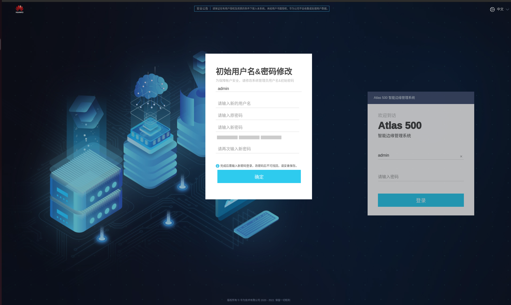
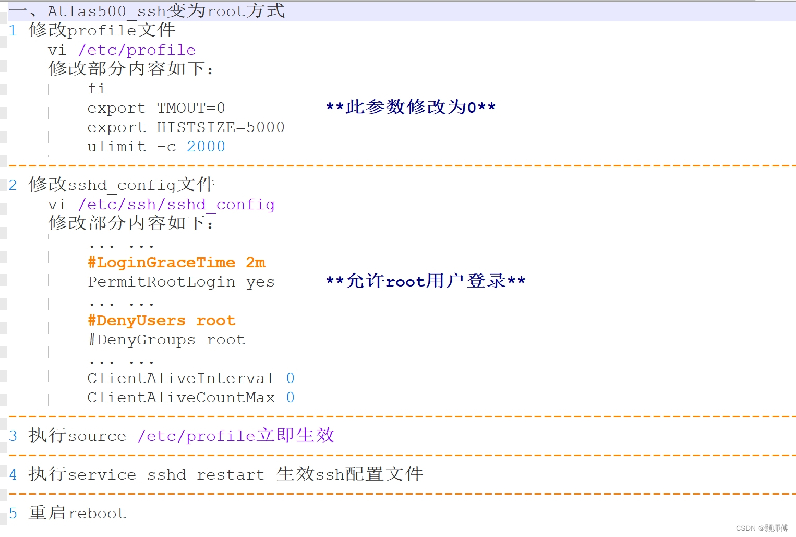

# 小站配置文档

## 首次登录配置

1. 路由器配置: 更改路由器DHCP为`192.168.2.[1 ~ 255]`


1. 网络连接：小站与路由器网线直连。小站网络端口1:`192.168.2.111`


1. 进入web后台： 同一局域网内存访问小站`192.168.2.111`。如果浏览器显示“此网站的安全证书有问题”，请单击“继续浏览此网站”


1. 输入用户名和密码: 默认用户名`admin` 默认密码`Huawei12#$`
2. 在弹出的修改窗口中，输入新用户名、原密码、新密码、确认密码并单击“确定”，完成用户名和密码修改。


1. 在登录界面，再次输入用户名和新的密码。

1. 登录进入web系统


## ssh远程登陆配置

1. 用新的用户名密码 `ssh atlas@192.168.2.111` 登陆小站


2. 进入 `IES:`命令窗口


3. 在IES窗口输入`sftp enable`命令开启`stfp`文件传输。


4. 进入开发模式也是以**root**用户进入系统,在IES中输入`develop`命令，会提示输入密码，默认密码:`Huawei@SYS3`。第一次进入会提示修改密码。


5. 进入开发模式后开启**root用户登录**。配置如下



### sftp配置

1. 之前已经开启小站sftp服务。


2. 增加sftp的访问目录`/home/zhonghang`。默认有`/tmp`目录。


3. 通过sftp客户端链接小站。


4. 将本地的代码文件上传至小站的`/home/zhonghang`目录下。

```sh

sftp root@192.168.2.111

put -r [dir] .
put [file] .
get [file] .
get -r [dir] .

```

- [SFTP文件传输基本命令](https://blog.csdn.net/Trance95/article/details/128735668)

### 网络配置

由于小站默认不开启外网访问，需要开启外网访问需要额外配置。

1. ssh root进入系统

2. 增加dns配置,往`/etc/resolv.conf`文件写入`nameserver 114.114.114.114`


3. 增加网关配置 `route add default gw 192.168.2.1`。**每次重新小站后都要运行此配置**


4. 进行网络测试 `ping www.baidu.com`


### 文件挂载配置

**由于小站系统的内存很少，我们需要额外挂载磁盘分区。我这里需要挂载了两个分区 `/home/docker`(docker镜像运行目录) `/home/zhonghang`(项目存储目录)**


1. ssh root进入远程命令窗口执行`/opt/middleware/MindXOM/bin/mount_white_path add [path]`命令，将挂载路径手动添加到白名单中

```sh
/opt/middleware/MindXOM/bin/mount_white_path add /home/docker
/opt/middleware/MindXOM/bin/mount_white_path add /home/zhonghang
```


2. 进入web管理后台 -> 管理 -> 磁盘


3. 点击 **/dev/hdisk0** 后面的创建分区


4. 点击后面的**创建分区**, 创建2个100G分区。没有出现新的分区，点击刷新。


5. 在web管理后台，在刚创建好的分区点击挂载路径


### docker环境配置

由于小站系统的内存很少，需要重新配置docker `data-root`目录。直接用上面创建的目录。

1. ssh root进入远程命令窗口。

2. 在`/etc/docker/daemon.json`增加`"data-root": "/home/docker"`配置。


3. `docker info | grep  "Docker Root Dir"` 查看配置是否生效。


----

**参考链接**

- [官方文档](https://support.huawei.com/enterprise/zh/doc/EDOC1100133176/426cffd9)

- [所有手册](https://support.huawei.com/enterprise/zh/ascend-computing/a500-3000-pid-250702836)

- [华为500小站预配置](https://blog.csdn.net/hh1357102/article/details/130169513)

- [Atlas 500应用](https://support.huaweicloud.com/adevg-atlas500app/atlas500development_01_0001.html)

- [Atlas 500 制作容器镜像](https://support.huawei.com/enterprise/zh/doc/EDOC1100133176/7d1c2891)