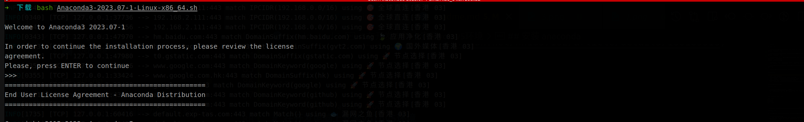

# CANN环境配置

## 本地开发环境配置

### 本地配置yolov5训练环境

1. 安装 anaconda

   1. [下载安装文件](https://www.anaconda.com/download) 

   2. 执行安装命令

```sh

chmod +x Anaconda3-2023.07-1-Linux-x86_64.sh

bash Anaconda3-2023.07-1-Linux-x86_64.sh

# 全部选择yes

# 启动命令窗口,不激活base环境
conda config --set auto_activate_base false
```




2. 配置yolov5环境

```sh

# 创建 pytorch 环境
conda create --name ascend python=3.7

# 激活 环境
conda activate ascend

mkdir -p ${HOME}/ascend_soft

cd ${HOME}/ascend_soft

# 克隆yolov5代码
git clone https://github.com/ultralytics/yolov5.git

cd yolov5

# 切换到 v6.2 分支版本
git checkout v6.2

# 安装yolov5运行依赖
pip3 install -r requirements.txt -i https://pypi.tuna.tsinghua.edu.cn/simple

```


### 本地安装开发环境

> 模型转换需要用到此配置

```sh

cd ${HOME}/ascend_soft

# Ascend-cann-toolkit_6.0.1_linux-x86_64.run 在软件包中
chmod +x Ascend-cann-toolkit_6.0.1_linux-x86_64.run

# 校验软件包安装文件的一致性和完整性
./Ascend-cann-toolkit_6.0.1_linux-x86_64.run --check

# 安装软件
./Ascend-cann-toolkit_6.0.1_linux-x86_64.run --install

```

配置环境变量: 在`~/.bashrc`追加下面配置

```sh
source ${HOME}/Ascend/ascend-toolkit/set_env.sh
export LD_LIBRARY_PATH=${HOME}/Ascend/ascend-toolkit/latest/x86_64-linux/devlib/:$LD_LIBRARY_PATH
```

立即启用配置

```sh
source ~/.bashrc
```

### 本地安装开发依赖包(这一步也可以跳过,推荐安装)

> 本地安装开发环境，可以在本地编译代码，方便发现开发中的错误。

1. c++环境依赖

```sh

# 以安装用户在开发环境任意目录下执行以下命令，打开.bashrc文件。
vi ~/.bashrc  

# 在文件最后一行后面添加如下内容

# CPU_ARCH环境变量请根据运行环境cpu架构填写
export CPU_ARCH=x86_64
# THIRDPART_PATH需要按照运行环境安装路径设置
export THIRDPART_PATH=${HOME}/Ascend/thirdpart/${CPU_ARCH}  #代码编译时链接第三方库
# CANN软件安装后文件存储路径，最后一级目录请根据运行环境设置
export INSTALL_DIR=${HOME}/Ascend/ascend-toolkit/latest/x86_64-linux
# 执行命令保存文件并退出。

:wq!  

# 执行命令使其立即生效。 
source ~/.bashrc
# 创建第三方依赖文件夹
mkdir -p ${THIRDPART_PATH}

cd ${HOME}/ascend_soft

git clone https://gitee.com/ascend/samples.git

# 拷贝公共文件到第三方依赖文件夹
cp -r ${HOME}/ascend_soft/samples/common ${THIRDPART_PATH}

```

2. 安装ffmpeg和x264、acllite

```sh

# 1. 安装 x264 编解码器
cd ${HOME}/ascend_soft

# 1.1. 下载 x264
git clone https://code.videolan.org/videolan/x264.git

cd x264

# 1.2. 配置 x264
./configure --enable-shared --disable-asm

# 1.3. 编译 x264
make -j$(nproc)

# 1.4. 安装 x264
sudo make install

# 1.5. 拷贝lib文件
sudo cp /usr/local/lib/libx264.so.164 /lib

# 2. 安装 ffmpeg
cd ${HOME}/ascend_soft

# 2. 下载 ffmpeg
wget http://www.ffmpeg.org/releases/ffmpeg-4.1.3.tar.gz --no-check-certificate

# 2.1. 解压 ffmpeg
tar -zxvf ffmpeg-4.1.3.tar.gz
cd ffmpeg-4.1.3

# 2.2. 配置 ffmpeg
./configure --enable-shared --enable-pic --enable-static --disable-x86asm --enable-libx264 --enable-gpl --prefix=${THIRDPART_PATH}

# 2.3. 编译 ffmpeg
make -j$(nproc)

# 2.4. 安装 ffmpeg
sudo make install

# 3. 安装 acllite

# 3.1. 进入 acllite 目录
cd ${HOME}/ascend_soft/samples/cplusplus/common/acllite/

# 3.2. 编译 acllite
make -j$(nproc)

# 3.3. 安装 acllite
sudo make install

# 4. 安装 presentagent

# 4.1. 安装 protobuf 相关依赖
sudo apt-get install autoconf automake libtool

# 4.2. 激活 pytorch 环境
conda activate pytorch

# 4.3. 安装 presentserver 启动所需要的python库
pip install tornado==5.1.0 protobuf Cython numpy --user

# 4.4. 下载protobuf源码

cd ${HOME}/ascend_soft

git clone -b 3.13.x https://gitee.com/mirrors/protobufsource.git protobuf

cd protobuf 

# 4.5. 配置 protobuf
./autogen.sh

./configure --prefix=${THIRDPART_PATH}

# 4.6. 编译 protobuf
make -j$(nproc)

# 4.7. 安装 protobuf
sudo make install

cd ${HOME}/ascend_soft/samples/cplusplus/common/presenteragent/proto

sudo ldconfig

# 4.8 生成proto文件
protoc presenter_message.proto --cpp_out=./

cd ..

# 4.9. 安装presenteragent
make -j$(nproc)

# 4.10. 安装presenteragent
sudo make install

```

### 小站容器运行，开发环境配置

1. 导入已有运行环境基础镜像

```sh

docker load < infer-modelzoo.tar

```

2. 容器运行

```sh

docker run -it --net=host --privileged -u root \
--device=/dev/davinci0 \
--device=/dev/davinci_manager \
--device=/dev/devmm_svm \
--device=/dev/hisi_hdc \
-v /usr/local/dcmi:/usr/local/dcmi \
-v /var/log/npu:/var/log/npu \
-v /home/data/miniD/driver/driver:/usr/local/Ascend/driver \
-v /usr/slog:/usr/slog \
-v /usr/local/bin/npu-smi:/usr/local/bin/npu-smi:ro \
-v /home/data/miniD/driver/lib64:/usr/local/Ascend/driver/lib64:ro \
-v /etc/ascend_install.info:/etc/ascend_install.info:ro \
-v /home/data/miniD/driver/tools/:/usr/local/Ascend/driver/tools/ \
-v /home/data/miniD/driver/add-ons/:/usr/local/Ascend/add-ons/ \
-v /data:/data \
-v /home/workspace/ascend_soft:/home/data/core \
-w /home/data/core \
ascendhub.huawei.com/public-ascendhub/infer-modelzoo:22.0.0 \
/bin/bash

```

| 参数 | 参数说明 |
|---|---|
| --device | 表示映射的设备，可以挂载一个或者多个设备。需要挂载的设备如下： </br>/dev/davinciX：NPU设备，X是ID号，如：davinci0。</br>/dev/davinci_manager：davinci相关的管理设备。</br>/dev/devmm_svm：内存管理相关设备。</br>/dev/hisi_hdc：hdc相关管理设备。
| -v /usr/local/bin/npu-smi:/usr/local/bin/npu-smi | 将宿主机npu-smi工具“/usr/local/bin/npu-smi”挂载到容器中，请根据实际情况修改。 |
| -v /usr/local/Ascend/driver/lib64:/usr/local/Ascend/driver/lib64 | 将宿主机目录“/usr/local/Ascend/driver/lib64/ ”挂载到容器，请根据驱动所在实际路径修改。 |
| -v /etc/ascend_install.info:/etc/ascend_install.info | 将宿主机安装信息文件“/etc/ascend_install.info”挂载到容器中。 |
| -v /home/data/miniD/driver/version.info:/home/data/miniD/driver/version.info | 将宿主机版本信息文件“/home/data/miniD/driver/version.info”挂载到容器中，请根据实际情况修改。 |
| -v /home/workspace/ascend_soft:/home/data/core | 将宿主机工程文件挂在到容器中。 |


3. 容器开发环境配置

```sh

cd /home/data/core

chmod 1777 /tmp

apt-get update

bash /usr/local/Ascend/ascend-toolkit/set_env.sh

# Ascend-cann-nnrt_6.0.1_linux-aarch64.run 推理程序
chmod +x Ascend-cann-nnrt_6.0.1_linux-aarch64.run

# 校验软件包安装文件的一致性和完整性
./Ascend-cann-nnrt_6.0.1_linux-aarch64.run --check

# 安装软件
./Ascend-cann-nnrt_6.0.1_linux-aarch64.run --install

# 以安装用户在开发环境任意目录下执行以下命令，打开.bashrc文件。
vi ~/.bashrc  

# 在文件最后一行后面添加如下内容

# CPU_ARCH环境变量请根据运行环境cpu架构填写
export CPU_ARCH=aarch64
# THIRDPART_PATH需要按照运行环境安装路径设置
export THIRDPART_PATH=${HOME}/Ascend/thirdpart/${CPU_ARCH}  #代码编译时链接第三方库
# CANN软件安装后文件存储路径，最后一级目录请根据运行环境设置
export INSTALL_DIR=${HOME}/Ascend/ascend-toolkit/latest/arm64-linux
# 执行命令保存文件并退出。

:wq!  

# 执行命令使其立即生效。 
source ~/.bashrc
# 创建第三方依赖文件夹
mkdir -p ${THIRDPART_PATH}

# 拷贝公共文件到第三方依赖文件夹
cp -r /home/data/core/samples/common ${THIRDPART_PATH}

# 1. 安装 x264 编解码器
cd /home/data/core/x264

make clean

# 1.2. 配置 x264
./configure --enable-shared --disable-asm

# 1.3. 编译 x264
make -j$(nproc)

# 1.4. 安装 x264
make install

# 1.5. 拷贝lib文件
cp /usr/local/lib/libx264.so.164 /lib

# 2. 安装 ffmpeg
cd /home/data/core/ffmpeg-4.1.3

make clean

# 2.2. 配置 ffmpeg
./configure --enable-shared --enable-pic --enable-static --disable-x86asm --enable-libx264 --enable-gpl --prefix=${THIRDPART_PATH}

# 2.3. 编译 ffmpeg
make -j$(nproc)

# 2.4. 安装 ffmpeg
make install

# 3. 安装 acllite

# 3.1. 进入 acllite 目录
cd /home/data/core/samples/cplusplus/common/acllite/

make clean

# 3.2. 编译 acllite
make -j$(nproc)

# 3.3. 安装 acllite
make install

# 4. 安装 presentagent

# 4.1. 安装 protobuf 相关依赖
apt-get install autoconf automake libtool

# 4.2. 安装pip3
apt-get install python3-pip 

# 4.3. 安装 presentserver 启动所需要的python库
python3.7 -m pip install tornado==5.1.0 protobuf Cython numpy --user

# 4.4. 下载protobuf源码

cd /home/data/core/protobuf

make clean

# 4.5. 配置 protobuf
./autogen.sh

./configure --prefix=${THIRDPART_PATH}

# 4.6. 编译 protobuf
make -j$(nproc)

# 4.7. 安装 protobuf
make install

cd /home/data/core/samples/cplusplus/common/presenteragent/proto

ldconfig

# 4.8 生成proto文件
protoc presenter_message.proto --cpp_out=./

cd ..

make clean

# 4.9. 安装presenteragent
make -j$(nproc)

# 4.10. 安装presenteragent
make install

```

------

**参考链接**

- [昇腾镜像仓库](https://ascendhub.huawei.com/#/index)

- [Atlas 500 制作容器镜像](https://support.huawei.com/enterprise/zh/doc/EDOC1100133176/7d1c2891)

- [命令行方式启动容器镜像](https://support.huawei.com/enterprise/zh/doc/EDOC1100133176/f9b9f512)

- [宿主机目录挂载至容器](https://www.hiascend.com/document/detail/zh/canncommercial/601/envdeployment/instg/instg_000115.html)

- [第三方依赖安装指导](https://gitee.com/ascend/samples/tree/master/cplusplus/environment)

- [昇腾AI设备安装开发环境](https://gitee.com/ascend/samples/blob/master/cplusplus/environment/catenation_environmental_guidance_CN.md)

- [非昇腾AI设备上安装开发环境场景下的第三方依赖安装](https://gitee.com/ascend/samples/blob/master/cplusplus/environment/separate_environmental_guidance_CN.md)