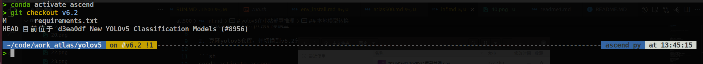
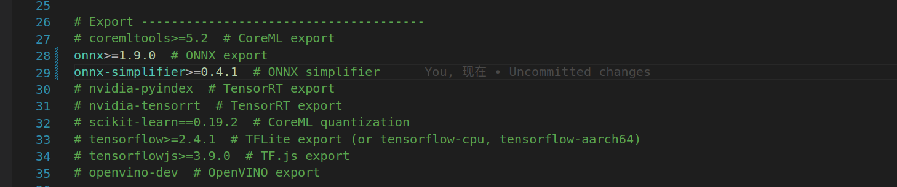
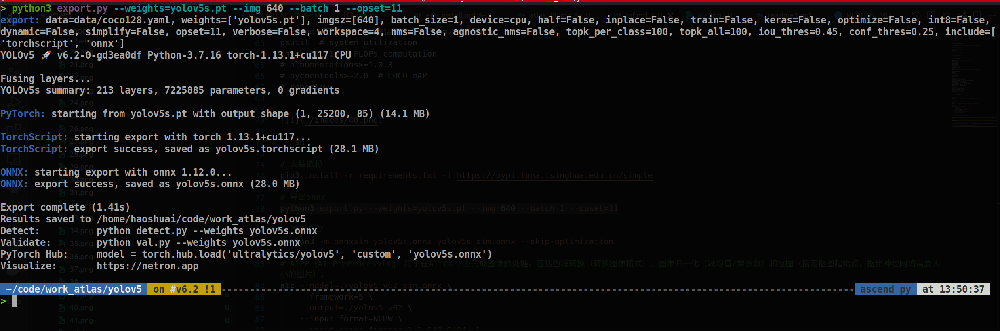
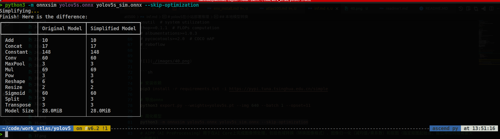
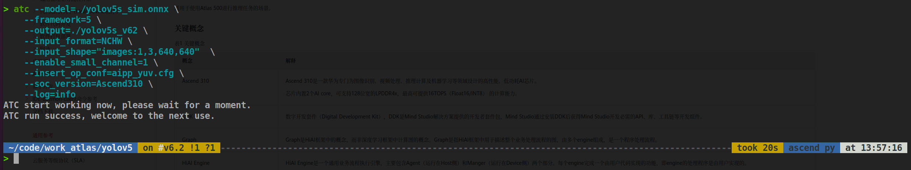
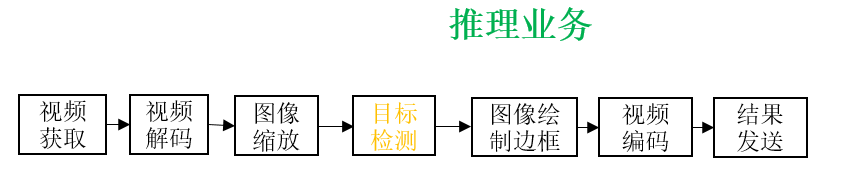
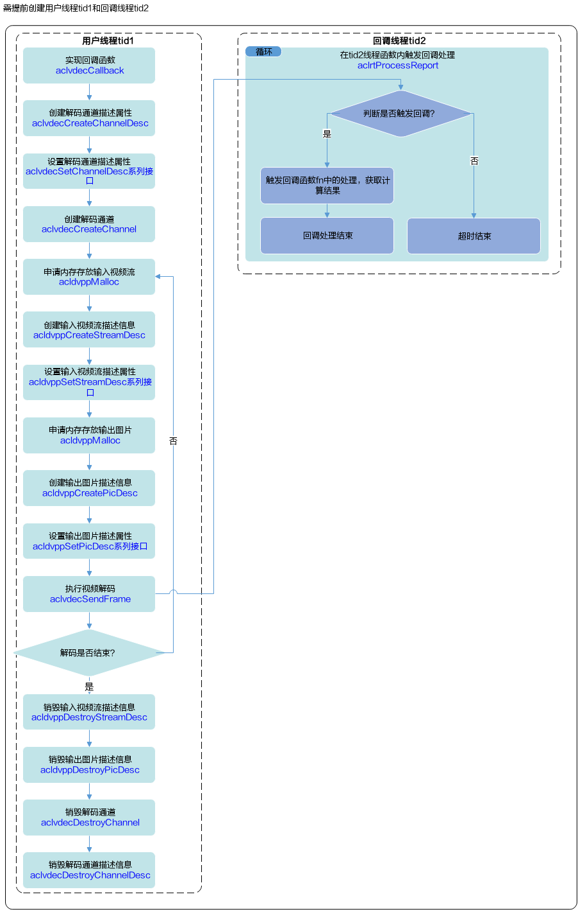
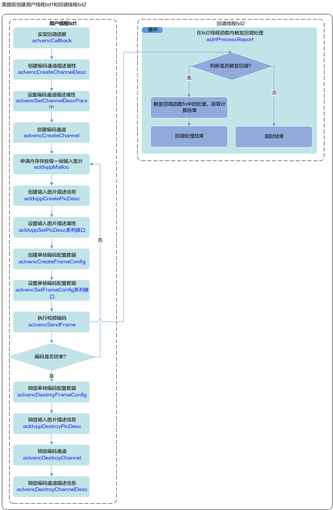

# yolov5在小站部署推理

## 本地模型转换

> 这里演示官方的6.2版本的yolov5s.pt预训练模型

1. 下载好yolov5s.pt预训练模型

2. 准备好aipp文件,文件内容如下

> AIPP（AI PreProcessing）用于在AI Core上完成图像预处理，包括色域转换（转换图像格式）、图像归一化（减均值/乘系数）和抠图（指定抠图起始点，抠出神经网络需要大小的图片）。

```cfg
aipp_op{
aipp_mode:static
src_image_size_w : 640
src_image_size_h : 640
input_format : YUV420SP_U8
csc_switch : true
rbuv_swap_switch : false
matrix_r0c0 : 298
matrix_r0c1 : 0
matrix_r0c2 : 409
matrix_r1c0 : 298
matrix_r1c1 : -100
matrix_r1c2 : -208
matrix_r2c0 : 298
matrix_r2c1 : 516
matrix_r2c2 : 0
input_bias_0 : 16
input_bias_1 : 128
input_bias_2 : 128

var_reci_chn_0 :0.003921568627451
var_reci_chn_1 :0.003921568627451
var_reci_chn_2 :0.003921568627451
}

#input_format : RGB888_U8
```


3. 克隆yolov5仓库，并切换到v6.2分支，把下载好的模型，以及aipp文件aipp_yuv.cfg，放到yolov5文件夹下

```sh
conda activate ascend

cd ${HOME}/ascend_soft/yolov5

git checkout v6.2

#修改 requirements.txt

```



```txt
# YOLOv5 requirements
# Usage: pip install -r requirements.txt

# Base ----------------------------------------
matplotlib>=3.2.2
numpy>=1.18.5
opencv-python>=4.1.1
Pillow>=7.1.2
PyYAML>=5.3.1
requests>=2.23.0
scipy>=1.4.1
torch>=1.7.0
torchvision>=0.8.1
tqdm>=4.64.0
protobuf<=3.20.1  # https://github.com/ultralytics/yolov5/issues/8012

# Logging -------------------------------------
tensorboard>=2.4.1
# wandb
# clearml

# Plotting ------------------------------------
pandas>=1.1.4
seaborn>=0.11.0

# Export --------------------------------------
# coremltools>=5.2  # CoreML export
onnx>=1.9.0  # ONNX export 取消此处注释
onnx-simplifier>=0.4.1  # ONNX simplifier 取消此处注释
# nvidia-pyindex  # TensorRT export
# nvidia-tensorrt  # TensorRT export
# scikit-learn==0.19.2  # CoreML quantization
# tensorflow>=2.4.1  # TFLite export (or tensorflow-cpu, tensorflow-aarch64)
# tensorflowjs>=3.9.0  # TF.js export
# openvino-dev  # OpenVINO export

# Extras --------------------------------------
ipython  # interactive notebook
psutil  # system utilization
thop>=0.1.1  # FLOPs computation
# albumentations>=1.0.3
# pycocotools>=2.0  # COCO mAP
# roboflow
```



```sh

# 安装依赖
pip3 install -r requirements.txt -i https://pypi.tuna.tsinghua.edu.cn/simple

# 导出onnx
python3 export.py --weights=yolov5s.pt --img 640 --batch 1 --opset=11

# 简化模型
python3 -m onnxsim yolov5s.onnx yolov5s_sim.onnx --skip-optimization

# AIPP（AI PreProcessing）用于在AI Core上完成图像预处理，包括色域转换（转换图像格式）、图像归一化（减均值/乘系数）和抠图（指定抠图起始点，抠出神经网络需要大小的图片）。
atc --model=./yolov5s_sim.onnx \
    --framework=5 \
    --output=./yolov5s_v62 \
    --input_format=NCHW \
    --input_shape="images:1,3,640,640"  \
    --enable_small_channel=1 \
    --insert_op_conf=aipp_yuv.cfg \
    --soc_version=Ascend310 \
    --log=info

# 最后得到 om 模型文件
ll yolov5s_v62.om

```







**atc 参数说明**

| 参数 | 说明 |
|----|----|
| --model | 待转换的ONNX模型 |
| --framework | 5代表ONNX模型 |
| --output | 输出的om模型 |
| --input_format | 输入数据的格式。 |
| --input_shape | 输入数据的shape |
| --enable_small_channel | 是否使能small channel的优化，使能后在channel<=4的首层卷积会有性能收益。 |
| --insert_op_conf | AIPP插入节点，通过config文件配置算子信息，功能包括图片色域转换、裁剪、归一化，主要用于处理原图输入数据，常与DVPP配合使用，详见下文数据预处理。 |
| --soc_version | 模型转换时指定芯片版本。 |
| --log | 设置ATC模型转换过程中显示日志的级别。 |

## 在小站推理容器中进行代码编译，以及运行

1. 推理业务流程



视频获取：通过RTSP拉取视频流。
视频解码：调用DVPP解码能力，转换为 YUV 格式图像数据。
图像缩放：调用DVPP，将图像缩放到一定尺寸大小。
目标检测：YoLoV5模型针对图像进行目标检测。
图像绘制边框：调用OSD基础功能在图片上绘制基本单元，如画框、写字、画线、画圆等。
视频编码：调用DVPP编码能力，转换为 H264 格式视频数据。
视频推流: 调用ffmpeg框架，进行rtmp推流。

2. 工程目录说明

```sh
atlas_yolov5
├── build
├── CMakeLists.txt
├── data
├── inc # 项目头文件
│   ├── common.h # ffmpeg 通用头文件
│   ├── drawing.h # 绘制字体 矩形
│   ├── ffmpeg_rtmp.h # ffmpeg rtmp 推流
│   ├── freetype_helper.h # 文字绘制
│   ├── object_detection.h # 推理的 数据配置文件
│   ├── rtmp_stream.h # ffmpeg rtmp 推流
│   ├── rtsp_stream.h # ffmpeg rtsp 推流
│   └── utils.h # atc通用工具类
├── model
│   ├── aipp_yuv.cfg # aipp文件
│   └── yolov5s_v62.om # 模型文件
├── out
│   └── main # 二进制 执行文件
├── run.sh
├── run_vlc.sh
├── scripts
│   ├── sample_build.sh # 编译脚本
│   ├── sample_run.sh # 运行脚本 废弃
│   └── yolov3_coco_detection_multi_thread.conf # 视频输入流配置
├── src
│   ├── acl.json # acl 配置文件
│   ├── CMakeLists.txt # 编译配置文件
│   ├── encoder # dvpp 硬编码，把后处理的yuv420 数据编码成h26视频流数据
│   ├── inference # 模型推理
│   ├── main.cpp # main
│   ├── postprocess # 推理结果 后处理 在yuv420上绘制 文字，矩形框结果
│   ├── preprocess # 推理前 视频流数据处理 把视频流硬解码，缩放 成模型需要的数据 h264(1280x720)->yuv420(640x640)
│   ├── pushstream # ffmpeg 推流，把硬编码的视频流用ffmpeg推流出去。
│   └── utils # 通用工具类
├── timming_enc.md
└── timming.md

```

**dvpp硬解码**

- [VDEC视频解码](https://www.hiascend.com/document/detail/zh/canncommercial/601/inferapplicationdev/aclcppdevg/aclcppdevg_000059.html)

流程图



样例代码

```cpp
using namespace std;

namespace {
    const uint32_t kFrameWidthMax = 4096;
    const uint32_t kFrameHeightMax = 4096;
}

VdecHelper::VdecHelper(int channelId, uint32_t width, uint32_t height,
    int type, aclvdecCallback callback, uint32_t outFormat)
    :channelId_(channelId), format_(outFormat), enType_(type),
    frameWidth_(width), frameHeight_(height), callback_(callback),
    isExit_(false), isReleased_(false)
{
    alignWidth_ = ALIGN_UP16(frameWidth_);
    alignHeight_ = ALIGN_UP2(frameHeight_);
    outputPicSize_ = YUV420SP_SIZE(alignWidth_, alignHeight_);
    vdecChannelDesc_ = nullptr;
    inputStreamDesc_ = nullptr;
    outputPicDesc_ = nullptr;
    outputPicBuf_ = nullptr;
    aclError aclRet;
    ACLLITE_LOG_INFO("get current context");
    aclRet = aclrtGetCurrentContext(&context_);
    if ((aclRet != ACL_SUCCESS) || (context_ == nullptr)) {
        ACLLITE_LOG_ERROR("VdecHelper : Get current acl context error:%d", aclRet);
    }
    ACLLITE_LOG_INFO("VDEC width %d, height %d", frameWidth_, frameHeight_);
}

VdecHelper::~VdecHelper()
{
    DestroyResource();
}

void VdecHelper::DestroyResource()
{
    if (isReleased_) {
        return;
    }

    aclError ret;
    if (inputStreamDesc_ != nullptr) {
        void* inputBuf = acldvppGetStreamDescData(inputStreamDesc_);
        if (inputBuf != nullptr) {
            acldvppFree(inputBuf);
        }
        aclError ret = acldvppDestroyStreamDesc(inputStreamDesc_);
        if (ret != ACL_SUCCESS) {
            ACLLITE_LOG_ERROR("fail to destroy input stream desc");
        }
        inputStreamDesc_ = nullptr;
    }

    if (outputPicDesc_ != nullptr) {
        void* outputBuf = acldvppGetPicDescData(outputPicDesc_);
        if (outputBuf != nullptr) {
            acldvppFree(outputBuf);
        }
        aclError ret = acldvppDestroyPicDesc(outputPicDesc_);
        if (ret != ACL_SUCCESS) {
            ACLLITE_LOG_ERROR("fail to destroy output pic desc");
        }
        outputPicDesc_ = nullptr;
    }

    if (vdecChannelDesc_ != nullptr) {
        ret = aclvdecDestroyChannel(vdecChannelDesc_);
        if (ret != ACL_SUCCESS) {
            ACLLITE_LOG_ERROR("Vdec destroy channel failed, errorno: %d", ret);
        }
        aclvdecDestroyChannelDesc(vdecChannelDesc_);
        vdecChannelDesc_ = nullptr;
    }

    UnsubscribReportThread();

    if (stream_ != nullptr) {
        ret = aclrtDestroyStream(stream_);
        if (ret != ACL_SUCCESS) {
            ACLLITE_LOG_ERROR("Vdec destroy stream failed");
        }
        stream_ = nullptr;
    }

    isReleased_ = true;
}

void* VdecHelper::SubscribeReportThreadFunc(void *arg)
{
    ACLLITE_LOG_INFO("Start vdec subscribe thread...");

    // Notice: create context for this thread
    VdecHelper* vdec = (VdecHelper *)arg;
    aclrtContext context = vdec->GetContext();
    aclError ret = aclrtSetCurrentContext(context);
    if (ret != ACL_SUCCESS) {
        ACLLITE_LOG_ERROR("Video decoder set context failed, error: %d", ret);
    }

    while (!vdec->IsExit()) {
        // Notice: timeout 1000ms
        aclrtProcessReport(1000);
    }

    ACLLITE_LOG_INFO("Vdec subscribe thread exit!");

    return (void*)ACLLITE_OK;
}

void VdecHelper::UnsubscribReportThread()
{
    if ((subscribeThreadId_ == 0) || (stream_ == nullptr)) return;

    (void)aclrtUnSubscribeReport(static_cast<uint64_t>(subscribeThreadId_),
                                 stream_);
    // destory thread
    isExit_ = true;

    void *res = nullptr;
    int joinThreadErr = pthread_join(subscribeThreadId_, &res);
    if (joinThreadErr) {
        ACLLITE_LOG_ERROR("Join thread failed, threadId = %lu, err = %d",
                          subscribeThreadId_, joinThreadErr);
    } else {
        if ((uint64_t)res != 0) {
            ACLLITE_LOG_ERROR("thread run failed. ret is %lu.", (uint64_t)res);
        }
    }
    ACLLITE_LOG_INFO("Destory report thread success.");
}

AclLiteError VdecHelper::Init()
{
    ACLLITE_LOG_INFO("Vdec process init start...");
    aclError aclRet = aclrtCreateStream(&stream_);
    if (aclRet != ACL_SUCCESS) {
        ACLLITE_LOG_ERROR("Vdec create stream failed, errorno:%d", aclRet);
        return ACLLITE_ERROR_CREATE_STREAM;
    }
    ACLLITE_LOG_INFO("Vdec create stream ok");

    int ret = pthread_create(&subscribeThreadId_, nullptr,
                             SubscribeReportThreadFunc, (void *)this);
    if (ret) {
        ACLLITE_LOG_ERROR("Start vdec subscribe thread failed, return:%d", ret);
        return ACLLITE_ERROR_CREATE_THREAD;
    }
    (void)aclrtSubscribeReport(static_cast<uint64_t>(subscribeThreadId_),
                               stream_);

    ret = CreateVdecChannelDesc();
    if (ret != ACLLITE_OK) {
        ACLLITE_LOG_ERROR("Create vdec channel failed");
        return ret;
    }

    return ACLLITE_OK;
}

AclLiteError VdecHelper::CreateVdecChannelDesc()
{
    vdecChannelDesc_ = aclvdecCreateChannelDesc();
    if (vdecChannelDesc_ == nullptr) {
        ACLLITE_LOG_ERROR("Create vdec channel desc failed");
        return ACLLITE_ERROR_CREATE_DVPP_CHANNEL_DESC;
    }

   // channelId: 0-15
    aclError ret = aclvdecSetChannelDescChannelId(vdecChannelDesc_,
                                                  channelId_);
    if (ret != ACL_SUCCESS) {
        ACLLITE_LOG_ERROR("Set vdec channel id to %d failed, errorno:%d",
                          channelId_, ret);
        return ACLLITE_ERROR_SET_VDEC_CHANNEL_ID;
    }

    ret = aclvdecSetChannelDescThreadId(vdecChannelDesc_, subscribeThreadId_);
    if (ret != ACL_SUCCESS) {
        ACLLITE_LOG_ERROR("Set vdec channel thread id failed, errorno:%d", ret);
        return ACLLITE_ERROR_SET_VDEC_CHANNEL_THREAD_ID;
    }

    // callback func
    ret = aclvdecSetChannelDescCallback(vdecChannelDesc_, callback_);
    if (ret != ACL_SUCCESS) {
        ACLLITE_LOG_ERROR("Set vdec channel callback failed, errorno:%d", ret);
        return ACLLITE_ERROR_SET_VDEC_CALLBACK;
    }

    ret = aclvdecSetChannelDescEnType(vdecChannelDesc_,
                                      static_cast<acldvppStreamFormat>(enType_));
    if (ret != ACL_SUCCESS) {
        ACLLITE_LOG_ERROR("Set vdec channel entype failed, errorno:%d", ret);
        return ACLLITE_ERROR_SET_VDEC_ENTYPE;
    }

    ret = aclvdecSetChannelDescOutPicFormat(vdecChannelDesc_,
                                            static_cast<acldvppPixelFormat>(format_));
    if (ret != ACL_SUCCESS) {
        ACLLITE_LOG_ERROR("Set vdec channel pic format failed, errorno:%d", ret);
        return ACLLITE_ERROR_SET_VDEC_PIC_FORMAT;
    }

    // create vdec channel
    ACLLITE_LOG_INFO("Start create vdec channel by desc...");
    ret = aclvdecCreateChannel(vdecChannelDesc_);
    if (ret != ACL_SUCCESS) {
        ACLLITE_LOG_ERROR("fail to create vdec channel");
        return ACLLITE_ERROR_CREATE_VDEC_CHANNEL;
    }
    ACLLITE_LOG_INFO("Create vdec channel ok");

    return ACLLITE_OK;
}

AclLiteError VdecHelper::CreateInputStreamDesc(shared_ptr<FrameData> frameData)
{
    inputStreamDesc_ = acldvppCreateStreamDesc();
    if (inputStreamDesc_ == nullptr) {
        ACLLITE_LOG_ERROR("Create input stream desc failed");
        return ACLLITE_ERROR_CREATE_STREAM_DESC;
    }

    aclError ret;
    // to the last data,send an endding signal to dvpp vdec
    if (frameData->isFinished) {
        ret = acldvppSetStreamDescEos(inputStreamDesc_, 1);
        if (ret != ACL_SUCCESS) {
            ACLLITE_LOG_ERROR("Set EOS to input stream desc failed, errorno:%d", ret);
            return ACLLITE_ERROR_SET_STREAM_DESC_EOS;
        }
        return ACLLITE_OK;
    }

    ret = acldvppSetStreamDescData(inputStreamDesc_, frameData->data);
    if (ret != ACL_SUCCESS) {
        ACLLITE_LOG_ERROR("Set input stream data failed, errorno:%d", ret);
        return ACLLITE_ERROR_SET_STREAM_DESC_DATA;
    }
    
    // set size for dvpp stream desc
    ret = acldvppSetStreamDescSize(inputStreamDesc_, frameData->size);
    if (ret != ACL_SUCCESS) {
        ACLLITE_LOG_ERROR("Set input stream size failed, errorno:%d", ret);
        return ACLLITE_ERROR_SET_STREAM_DESC_SIZE;
    }

    acldvppSetStreamDescTimestamp(inputStreamDesc_, frameData->frameId);

    return ACLLITE_OK;
}

AclLiteError VdecHelper::CreateOutputPicDesc(size_t size)
{
    // Malloc output device memory
    aclError ret = acldvppMalloc(&outputPicBuf_, size);
    if (ret != ACL_SUCCESS) {
        ACLLITE_LOG_ERROR("Malloc vdec output buffer failed when create "
                          "vdec output desc, errorno:%d", ret);
        return ACLLITE_ERROR_MALLOC_DVPP;
    }

    outputPicDesc_ = acldvppCreatePicDesc();
    if (outputPicDesc_ == nullptr) {
        ACLLITE_LOG_ERROR("Create vdec output pic desc failed");
        return ACLLITE_ERROR_CREATE_PIC_DESC;
    }

    ret = acldvppSetPicDescData(outputPicDesc_, outputPicBuf_);
    if (ret != ACL_SUCCESS) {
        ACLLITE_LOG_ERROR("Set vdec output pic desc data failed, errorno:%d", ret);
        return ACLLITE_ERROR_SET_PIC_DESC_DATA;
    }

    ret = acldvppSetPicDescSize(outputPicDesc_, size);
    if (ret != ACL_SUCCESS) {
        ACLLITE_LOG_ERROR("Set vdec output pic size failed, errorno:%d", ret);
        return ACLLITE_ERROR_SET_PIC_DESC_SIZE;
    }

    ret = acldvppSetPicDescWidth(outputPicDesc_, frameWidth_);
    if (ret != ACL_SUCCESS) {
        ACLLITE_LOG_ERROR("Set vdec output pic width failed, errorno:%d", ret);
        return ACLLITE_ERROR_VDEC_SET_WIDTH;
    }

    ret = acldvppSetPicDescHeight(outputPicDesc_, frameHeight_);
    if (ret != ACL_SUCCESS) {
        ACLLITE_LOG_ERROR("Set vdec output pic height failed, errorno:%d", ret);
        return ACLLITE_ERROR_VDEC_SET_HEIGHT;
    }

    ret = acldvppSetPicDescWidthStride(outputPicDesc_, alignWidth_);
    if (ret != ACL_SUCCESS) {
        ACLLITE_LOG_ERROR("Set vdec output pic widthStride failed, errorno:%d", ret);
        return ACLLITE_ERROR;
    }

    ret = acldvppSetPicDescHeightStride(outputPicDesc_, alignHeight_);
    if (ret != ACL_SUCCESS) {
        ACLLITE_LOG_ERROR("Set vdec output pic heightStride failed, errorno:%d", ret);
        return ACLLITE_ERROR;
    }

    ret = acldvppSetPicDescFormat(outputPicDesc_,
                                  static_cast<acldvppPixelFormat>(format_));
    if (ret != ACL_SUCCESS) {
        ACLLITE_LOG_ERROR("Set vdec output pic format failed, errorno:%d", ret);
        return ACLLITE_ERROR_SET_PIC_DESC_FORMAT;
    }

    return ACLLITE_OK;
}

AclLiteError VdecHelper::Process(shared_ptr<FrameData> frameData, void* userData)
{
    // create input desc
    AclLiteError atlRet = CreateInputStreamDesc(frameData);
    if (atlRet != ACLLITE_OK) {
        ACLLITE_LOG_ERROR("Create stream desc failed");
        return atlRet;
    }

    if (!frameData->isFinished) {
        // create out desc
        atlRet = CreateOutputPicDesc(outputPicSize_);
        if (atlRet != ACLLITE_OK) {
            ACLLITE_LOG_ERROR("Create pic desc failed");
            return atlRet;
        }
    } else {
        outputPicDesc_ = acldvppCreatePicDesc();
        if (outputPicDesc_ == nullptr) {
            ACLLITE_LOG_ERROR("Create vdec output pic desc failed");
            return ACLLITE_ERROR_CREATE_PIC_DESC;
        }
    }

    // send data to dvpp vdec to decode
    aclError ret = aclvdecSendFrame(vdecChannelDesc_, inputStreamDesc_,
                                    outputPicDesc_, nullptr, userData);
    if (ret != ACL_SUCCESS) {
        ACLLITE_LOG_ERROR("Send frame to vdec failed, errorno:%d", ret);
        return ACLLITE_ERROR_VDEC_SEND_FRAME;
    }

    return ACLLITE_OK;
}

AclLiteError VdecHelper::SetFormat(uint32_t format)
{
    if ((format != PIXEL_FORMAT_YUV_SEMIPLANAR_420) ||
        (format != PIXEL_FORMAT_YVU_SEMIPLANAR_420)) {
        ACLLITE_LOG_ERROR("Set video decode output image format to %d failed, "
            "only support %d(YUV420SP NV12) and %d(YUV420SP NV21)",
            format,
            (int)PIXEL_FORMAT_YUV_SEMIPLANAR_420,
            (int)PIXEL_FORMAT_YVU_SEMIPLANAR_420);
        return ACLLITE_ERROR_VDEC_FORMAT_INVALID;
    }

    format_ = format;
    ACLLITE_LOG_INFO("Set video decode output image format to %d ok", format);

    return ACLLITE_OK;
}

AclLiteError VdecHelper::VideoParamCheck()
{
    if ((frameWidth_ == 0) || (frameWidth_ > kFrameWidthMax)) {
        ACLLITE_LOG_ERROR("video frame width %d is invalid, the legal range is [0, %d]",
                          frameWidth_, kFrameWidthMax);
        return ACLLITE_ERROR_VDEC_INVALID_PARAM;
    }
    if ((frameHeight_ == 0) || (frameHeight_ > kFrameHeightMax)) {
        ACLLITE_LOG_ERROR("video frame height %d is invalid, the legal range is [0, %d]",
                          frameHeight_, kFrameHeightMax);
        return ACLLITE_ERROR_VDEC_INVALID_PARAM;
    }
    if ((format_ != PIXEL_FORMAT_YUV_SEMIPLANAR_420) &&
        (format_ != PIXEL_FORMAT_YVU_SEMIPLANAR_420)) {
        ACLLITE_LOG_ERROR("video decode image format %d invalid, "
                          "only support %d(YUV420SP NV12) and %d(YUV420SP NV21)",
                          format_, (int)PIXEL_FORMAT_YUV_SEMIPLANAR_420,
                          (int)PIXEL_FORMAT_YVU_SEMIPLANAR_420);
        return ACLLITE_ERROR_VDEC_INVALID_PARAM;
    }
    if (enType_ > (uint32_t)H264_HIGH_LEVEL) {
        ACLLITE_LOG_ERROR("Input video stream format %d invalid", enType_);
        return ACLLITE_ERROR_VDEC_INVALID_PARAM;
    }

    return ACLLITE_OK;
}
```

**dvpp硬编码**

- [VENC视频编码](https://www.hiascend.com/document/detail/zh/canncommercial/601/inferapplicationdev/aclcppdevg/aclcppdevg_000062.html)

流程图



样例代码

```cpp
using namespace std;
namespace
{
    int g_rcMode = 2;

    int g_maxBitRate = 10000;
    // g_gopSize
    int g_keyFrameInterval = 12;
}
// static const std::string g_outFile = "output/dvpp_venc.h264";
// static FILE *g_outFileFp = nullptr;
static bool g_runFlag = true;

std::chrono::time_point<std::chrono::steady_clock> g_t2, g_t3;

void encoder_time_d(float duration)
{
    static int count = 0;
    static float max = INT16_MIN;
    static float min = INT32_MAX;
    static float tD = 0;
    tD = tD + duration;
    count++;
    float avg = tD / float(count);
    max = duration > max ? duration : max;
    min = duration < min ? duration : min;

    printf("[encoder time] duration %f ms & avg %f ms & min %f ms & max %f ms \r\n", duration, avg, min, max);
}

void *VideoEncoder::SubscribleThreadFunc(aclrtContext sharedContext)
{
    if (sharedContext == nullptr)
    {
        ERROR_LOG("sharedContext can not be nullptr");
        return ((void *)(-1));
    }
    INFO_LOG("use shared context for this thread");
    aclError ret = aclrtSetCurrentContext(sharedContext);
    if (ret != ACL_SUCCESS)
    {
        ERROR_LOG("aclrtSetCurrentContext failed, errorCode = %d", static_cast<int32_t>(ret));
        return ((void *)(-1));
    }
    INFO_LOG("process callback thread start ");
    while (g_runFlag)
    {
        // Notice: timeout 1000ms
        (void)aclrtProcessReport(1000);
    }

    return nullptr;
}

// 回调编码后的数据帧
void VideoEncoder::Callback(acldvppPicDesc *input, acldvppStreamDesc *outputStreamDesc, void *userdata)
{

    std::chrono::duration<float> duration1;
    g_t3 = std::chrono::steady_clock::now();
    duration1 = g_t3 - g_t2;

    struct PushDataMsg *tmp = (struct PushDataMsg *)userdata;

    shared_ptr<PushDataMsg> pushData = make_shared<PushDataMsg>();

    if (tmp != nullptr)
    {
        pushData->channelId = tmp->channelId;
        pushData->frameWidth = tmp->frameWidth;
        pushData->frameHeight = tmp->frameHeight;
        pushData->pushThreadId = tmp->pushThreadId;

        free(tmp);
    } else {
        ERROR_LOG("Callback User Data is null");
    }

    // write to file
    void *outputDev = acldvppGetStreamDescData(outputStreamDesc);
    // check whether encode success
    uint32_t retCode = acldvppGetStreamDescRetCode(outputStreamDesc);

    if (retCode == 0)
    {
        // encode success, then process output pic
        uint32_t streamDescSize = acldvppGetStreamDescSize(outputStreamDesc);

        void *buffer = nullptr;
        buffer = Utils::CopyDataDeviceToLocal(outputDev, streamDescSize);

        ImageData imageData;
        imageData.width = pushData->frameWidth;
        imageData.height = pushData->frameHeight;
        imageData.size = streamDescSize;
        imageData.data.reset((uint8_t *)buffer, [](uint8_t *p)
                             { delete[] (p); });
        // imageData.data = SHARED_PTR_U8_BUF(buffer);

        pushData->imageData = imageData;

        encoder_time_d(duration1.count() * 1000.0f);

        SendMessage(pushData->pushThreadId, MSG_PUSH_STREAM, pushData);
        // INFO_LOG("VideoEncode success channelId %d size:%u", pushData->channelId, streamDescSize);
    }
    else
    {
        // encode fail, retuen
        ERROR_LOG("venc encode frame failed, ret = %d.", retCode);
        return;
    }
}

VideoEncoder::VideoEncoder(uint32_t width, uint32_t height) : deviceId_(0),
                                                              vencChannelDesc_(nullptr), vencFrameConfig_(nullptr),
                                                              inputPicputDesc_(nullptr), outputStreamDesc_(nullptr),
                                                              inBufferDev_(nullptr),
                                                              width_(width), height_(height)
{
    threadId_ = 0;
    inBufferSize_ = 0;
    format_ = PIXEL_FORMAT_YUV_SEMIPLANAR_420;
    enType_ = H264_MAIN_LEVEL;
    isInited_ = false;
}

VideoEncoder::~VideoEncoder()
{
    DestroyResource();
}

AclLiteError VideoEncoder::Init()
{

    if (isInited_)
    {
        ACLLITE_LOG_INFO("instance is initied already!\n");
        return ACLLITE_OK;
    }

    // check output folder

    g_context_ = GetContext();
    if (g_context_ == NULL)
    {
        ERROR_LOG("Get Context \n");
    }

    g_runMode_ = GetRunMode();

    // create stream
    aclError ret = aclrtCreateStream(&stream_);
    if (ret != ACL_SUCCESS)
    {
        ACLLITE_LOG_ERROR("acl create stream failed\n");
        return ACLLITE_ERROR_CREATE_STREAM;
    }

    ACLLITE_LOG_INFO("create stream success");

    ret = InitVencResource(width_, height_);

    if (ret != ACLLITE_OK)
    {
        ACLLITE_LOG_ERROR("Init venc resource failed, error: %d", ret);
        return ret;
    }

    isInited_ = true;

    return ACLLITE_OK;
}

AclLiteError VideoEncoder::Process(int msgId, shared_ptr<void> data)
{
    AclLiteError ret = ACLLITE_OK;
    // cout << "number_thread: " << msgId << endl;
    switch (msgId)
    {
    case MSG_ENCODER_DATA:
    {
        g_t2 = std::chrono::steady_clock::now();

        shared_ptr<EncoderDataMsg> encoderMsg = static_pointer_cast<EncoderDataMsg>(data);

        PushDataMsg *userData = (PushDataMsg *)malloc(sizeof(PushDataMsg));
        userData->channelId = encoderMsg->channelId;
        userData->frameWidth = encoderMsg->yuvImage.width;
        userData->frameHeight = encoderMsg->yuvImage.height;
        userData->pushThreadId = encoderMsg->pushThreadId;

        // INFO_LOG("VideoEncode start channelId %d", encoderMsg->channelId);

        VideoEncode(encoderMsg->yuvImage, userData);
        break;
    }

    case MSG_DECODE_FINISH:
        // SendMessage(g_MainThreadId, MSG_APP_EXIT, nullptr);
        break;
    default:
        ACLLITE_LOG_INFO("VideoEncoder thread ignore msg %d", msgId);
        break;
    }

    return ret;
}

AclLiteError VideoEncoder::InitAclResource()
{
    return ACLLITE_OK;
}

Result VideoEncoder::SetFrameConfig(uint8_t eos, uint8_t forceIFrame)
{
    // set eos
    aclError ret = aclvencSetFrameConfigEos(vencFrameConfig_, eos);
    if (ret != ACL_SUCCESS)
    {
        ERROR_LOG("fail to set eos, ret = %d", ret);
        return FAILED;
    }

    ret = aclvencSetFrameConfigForceIFrame(vencFrameConfig_, forceIFrame);
    if (ret != ACL_SUCCESS)
    {
        ERROR_LOG("fail to set venc ForceIFrame");
        return FAILED;
    }

    return SUCCESS;
}

// 创建编码通道描述
AclLiteError VideoEncoder::InitVencResource(uint32_t width, uint32_t height)
{
    // create process callback thread
    int createThreadErr = pthread_create(&threadId_, nullptr, &VideoEncoder::SubscribleThreadFunc, g_context_);

    if (createThreadErr != 0)
    {
        ERROR_LOG("create thread failed, err = %d", createThreadErr);
        return FAILED;
    }
    INFO_LOG("create process callback thread successfully, threadId = %lu", threadId_);

    // create vdec channelDesc
    vencChannelDesc_ = aclvencCreateChannelDesc();
    if (vencChannelDesc_ == nullptr)
    {
        ERROR_LOG("fail to create venc channel desc");
        return FAILED;
    }

    aclvencSetChannelDescThreadId(vencChannelDesc_, threadId_);
    aclvencSetChannelDescCallback(vencChannelDesc_, &VideoEncoder::Callback);
    aclvencSetChannelDescEnType(vencChannelDesc_, enType_);
    aclvencSetChannelDescPicFormat(vencChannelDesc_, format_);
    aclvencSetChannelDescPicWidth(vencChannelDesc_, width);
    aclvencSetChannelDescPicHeight(vencChannelDesc_, height);
    
    aclvencSetChannelDescKeyFrameInterval(vencChannelDesc_, g_keyFrameInterval);
    
    aclvencSetChannelDescRcMode(vencChannelDesc_, g_rcMode);
    
    aclvencSetChannelDescMaxBitRate(vencChannelDesc_, g_maxBitRate);
    // fps
    aclvencSetChannelDescSrcRate(vencChannelDesc_, 5);

    // create vdec channel
    auto ret = aclvencCreateChannel(vencChannelDesc_);
    if (ret != ACL_SUCCESS)
    {
        ERROR_LOG("fail to create venc channel");
        return FAILED;
    }
    vencFrameConfig_ = aclvencCreateFrameConfig();
    if (vencFrameConfig_ == nullptr)
    {
        ERROR_LOG("fail to create frame config");
        return FAILED;
    }

    // 第一帧数据

    // set frame config, no eos frame
    Result err = SetFrameConfig(0, 0);
    if (err != SUCCESS)
    {
        ERROR_LOG("fail to set frame config");
        return FAILED;
    }
    INFO_LOG("venc init resource success");
    return SUCCESS;
}

// 创建一帧数据的描述
Result VideoEncoder::CreatePicDesc()
{
    inputPicputDesc_ = acldvppCreatePicDesc();
    if (inputPicputDesc_ == nullptr)
    {
        ERROR_LOG("fail to create output pic desc");
        return FAILED;
    }
    auto ret = acldvppSetPicDescData(inputPicputDesc_, inBufferDev_);
    if (ret != ACL_SUCCESS)
    {
        ERROR_LOG("fail to set PicDescData");
        return FAILED;
    }
    ret = acldvppSetPicDescSize(inputPicputDesc_, inBufferSize_);
    if (ret != ACL_SUCCESS)
    {
        ERROR_LOG("fail to set PicDescSize");
        return FAILED;
    }

    ret = acldvppSetPicDescFormat(inputPicputDesc_, format_);
    if (ret != ACL_SUCCESS)
    {
        ERROR_LOG("fail to set acldvppSetPicDescFormat");
        return FAILED;
    }
    ret = acldvppSetPicDescWidth(inputPicputDesc_, width_);
    if (ret != ACL_SUCCESS)
    {
        ERROR_LOG("fail to set acldvppSetPicDescWidth");
        return FAILED;
    }
    ret = acldvppSetPicDescHeight(inputPicputDesc_, height_);
    if (ret != ACL_SUCCESS)
    {
        ERROR_LOG("fail to set acldvppSetPicDescHeight");
        return FAILED;
    }
    ret = acldvppSetPicDescWidthStride(inputPicputDesc_, width_);
    if (ret != ACL_SUCCESS)
    {
        ERROR_LOG("fail to set acldvppSetPicDescWidthStride");
        return FAILED;
    }
    ret = acldvppSetPicDescHeightStride(inputPicputDesc_, height_);
    if (ret != ACL_SUCCESS)
    {
        ERROR_LOG("fail to set acldvppSetPicDescHeightStride");
        return FAILED;
    }
    return SUCCESS;
}

// 编码 yuv420 数据帧
AclLiteError VideoEncoder::VideoEncode(ImageData &image, void *userdata)
{

    inBufferSize_ = image.size;

    // Malloc input device memory
    auto aclRet = acldvppMalloc(&inBufferDev_, inBufferSize_);
    if (aclRet != ACL_SUCCESS)
    {
        ERROR_LOG("acl malloc dvpp data failed, inBufferSize_=%u, ret=%d.\n", inBufferDev_, inBufferSize_);
        return false;
    }

    // host -> dvpp
    if (g_runMode_ != ACL_DEVICE)
    {
        aclRet = aclrtMemcpy(inBufferDev_, inBufferSize_, image.data.get(), image.size, ACL_MEMCPY_HOST_TO_DEVICE);
        if (aclRet != ACL_SUCCESS)
        {
            ERROR_LOG("acl memcpy data to dev failed, image.size=%u, ret=%d.\n", image.size, aclRet);
            (void)acldvppFree(inBufferDev_);
            inBufferDev_ = nullptr;
            return false;
        }
    }
    else
    {
        // copy input to device memory
        aclRet = aclrtMemcpy(inBufferDev_, inBufferSize_, image.data.get(), image.size, ACL_MEMCPY_DEVICE_TO_DEVICE);
        if (aclRet != ACL_SUCCESS)
        {
            ERROR_LOG("acl memcpy data to dev failed, image.size=%u, ret=%d.\n", image.size, aclRet);
            (void)acldvppFree(inBufferDev_);
            inBufferDev_ = nullptr;
            return false;
        }
    }

    // create picture desc
    Result err = CreatePicDesc();
    if (err != SUCCESS)
    {
        ERROR_LOG("fail to create picture description");
        return FAILED;
    }

    // send frame
    aclRet = aclvencSendFrame(vencChannelDesc_, inputPicputDesc_,
                              static_cast<void *>(outputStreamDesc_), vencFrameConfig_, userdata);

    if (aclRet != ACL_SUCCESS)
    {
        // fclose(g_outFileFp);
        // g_outFileFp = nullptr;
        ERROR_LOG("fail to send frame, aclRet=%u", aclRet);
        return FAILED;
    }

    /*************************************/
    // destory inBufferDev_
    (void)acldvppFree(inBufferDev_);
    inBufferDev_ = nullptr;
    /*************************************/
    return ACLLITE_OK;
}

AclLiteError VideoEncoder::DestroyVencResource()
{
    // 最后一帧 数据
    // set frame config, eos frame
    Result err = SetFrameConfig(1, 0);
    if (err != SUCCESS)
    {
        ERROR_LOG("fail to set eos frame config");
        return FAILED;
    }
    // send eos frame
    aclError ret = aclvencSendFrame(vencChannelDesc_, nullptr,
                                    nullptr, vencFrameConfig_, nullptr);
    if (ret != ACL_SUCCESS)
    {
        ERROR_LOG("fail to send eos frame, ret=%u", ret);
        return FAILED;
    }
    INFO_LOG("send eos frame success");

    if (vencFrameConfig_ != nullptr)
    {
        (void)aclvencDestroyFrameConfig(vencFrameConfig_);
        vencFrameConfig_ = nullptr;
    }

    if (inputPicputDesc_ != nullptr)
    {
        (void)acldvppDestroyPicDesc(inputPicputDesc_);
        inputPicputDesc_ == nullptr;
    }

    if (vencChannelDesc_ != nullptr)
    {
        (void)aclvencDestroyChannel(vencChannelDesc_);
        (void)aclvencDestroyChannelDesc(vencChannelDesc_);
        vencChannelDesc_ = nullptr;
    }

    // destory thread
    g_runFlag = false;
    void *res = nullptr;
    int joinThreadErr = pthread_join(threadId_, &res);
    if (joinThreadErr != 0)
    {
        ERROR_LOG("join thread failed, threadId = %lu, err = %d", threadId_, joinThreadErr);
    }
    else
    {
        if ((uint64_t)res != 0)
        {
            ERROR_LOG("thread run failed. ret is %lu.", (uint64_t)res);
        }
    }
    INFO_LOG("destory venc callback thread success");
}

void VideoEncoder::DestroyResource()
{
    DestroyVencResource();
    aclError ret;
    if (stream_ != nullptr)
    {
        ret = aclrtDestroyStream(stream_);
        if (ret != ACL_SUCCESS)
        {
            ACLLITE_LOG_ERROR("destroy stream failed");
        }
        stream_ = nullptr;
    }

}
```

**ffmpeg推流**

样例代码

```cpp

using namespace std;

RtmpStream::RtmpStream()
{
}

// 初始花流
int RtmpStream::InitStream(double width, double height, int fps, int bitrate, int gop_size, string codec_profile, string server)
{

    const char *output = server.c_str();

    int ret = avformat_alloc_output_context2(&g_ofmt_ctx, nullptr, "flv", nullptr);
    if (ret < 0)
    {
        std::cout << "Could not allocate output format context!" << std::endl;
        exit(1);
    }

    if (!(g_ofmt_ctx->oformat->flags & AVFMT_NOFILE))
    {
        ret = avio_open2(&g_ofmt_ctx->pb, output, AVIO_FLAG_WRITE, nullptr, nullptr);
        if (ret < 0)
        {
            std::cout << "Could not open output IO context!" << std::endl;
            exit(1);
        }
    }

    g_out_codec = avcodec_find_encoder(AV_CODEC_ID_H264);

    g_out_stream = avformat_new_stream(g_ofmt_ctx, g_out_codec);

    g_out_codec_ctx = avcodec_alloc_context3(g_out_codec);

    const AVRational dst_fps = {fps, 1};

    g_out_codec_ctx->codec_tag = 0;
    g_out_codec_ctx->codec_id = AV_CODEC_ID_H264;
    g_out_codec_ctx->codec_type = AVMEDIA_TYPE_VIDEO;
    g_out_codec_ctx->width = width;
    g_out_codec_ctx->height = height;
    g_out_codec_ctx->gop_size = gop_size;
    g_out_codec_ctx->pix_fmt = AV_PIX_FMT_NV12;
    g_out_codec_ctx->framerate = dst_fps;
    g_out_codec_ctx->time_base = av_inv_q(dst_fps);
    g_out_codec_ctx->bit_rate = bitrate;

    // 去掉B帧只留下 I帧和P帧
    g_out_codec_ctx->max_b_frames = 0;
    g_out_codec_ctx->qmin = 10;
    g_out_codec_ctx->qmax = 51;
    g_out_codec_ctx->qcompress = (float)0.6;

    // AV_CODEC_FLAG_GLOBAL_HEADER  -- 将全局头文件放在引渡文件中，而不是每个关键帧中。
    // AV_CODEC_FLAG_LOW_DELAY      -- 较低延迟
    g_out_codec_ctx->flags |= AV_CODEC_FLAG_GLOBAL_HEADER | AV_CODEC_FLAG_LOW_DELAY;


    g_ofmt_ctx->max_interleave_delta = 1000;
    g_ofmt_ctx->max_analyze_duration = 0;
    g_ofmt_ctx->probesize = 1024;

    ret = avcodec_parameters_from_context(g_out_stream->codecpar, g_out_codec_ctx);
    if (ret < 0)
    {
        ERROR_LOG("Could not initialize stream codec parameters!");
        exit(1);
    }

    AVDictionary *codec_options = nullptr;

    // H.264有四种画质级别,分别是baseline, extended, main, high：
    av_dict_set(&codec_options, "profile", codec_profile.c_str(), 0);
    // 指定编码的配置。 ultrafast编码速度最快，但压缩率低，生成的文件更大，
    av_dict_set(&codec_options, "preset", "superfast", 0);
    // 转码延迟，以牺牲视频质量减少时延
    av_dict_set(&codec_options, "tune", "zerolatency", 0);


    // open video encoder
    ret = avcodec_open2(g_out_codec_ctx, g_out_codec, &codec_options);
    if (ret < 0)
    {
        ERROR_LOG("Could not open video encoder!");
        exit(1);
    }

    g_out_stream->codecpar->extradata = g_out_codec_ctx->extradata;
    g_out_stream->codecpar->extradata_size = g_out_codec_ctx->extradata_size;

    av_dump_format(g_ofmt_ctx, 0, output, 1);


    g_video_frame = av_frame_alloc();
    int frame_buf_size = av_image_get_buffer_size(
        g_out_codec_ctx->pix_fmt, g_out_codec_ctx->width, g_out_codec_ctx->height, 1);
    std::cout << "[RtmpStream::Init] expected frame size " << frame_buf_size
              << std::endl;
    g_video_frame->width = g_out_codec_ctx->width;
    g_video_frame->height = g_out_codec_ctx->height;
    g_video_frame->format = static_cast<int>(g_out_codec_ctx->pix_fmt);
    g_video_frame->pts = 1;

    ret = avformat_write_header(g_ofmt_ctx, nullptr);
    if (ret < 0)
    {
        ERROR_LOG("Could not write header!");
        exit(1);
    }
    return ret;
}
static void custom_free(void *opaque, uint8_t *data)
{
    // free(data);
}

void RtmpStream::WriteEncodedFrame(const uint8_t *src, int width, int height, int size)
{
}

void RtmpStream::WriteFrame(const uint8_t *src, int width, int height, int size)
{
    int ret = 0;


    AVPacket pkt = {0};
    av_new_packet(&pkt, 0);
    av_init_packet(&pkt);

    pkt.pts = g_video_frame->pts;
    pkt.dts = pkt.pts;
    pkt.flags = AV_PKT_FLAG_KEY;
    pkt.buf = av_buffer_create((uint8_t *)src, size, custom_free, NULL, 0);
    pkt.data = (uint8_t *)src;
    pkt.size = size;
    // 直接写入编码后的裸流数据帧 AVPacket
    ret = av_write_frame(g_ofmt_ctx, &pkt);

    if (ret < 0)
    {
        std::cerr << "[WriteFrame] av_write_frame failed"
                  << std::endl;
        return;
    }

    // pkt.buf = nullptr;

    av_packet_unref(&pkt);

    g_video_frame->pts += av_rescale_q(1, g_out_codec_ctx->time_base, g_out_stream->time_base);

}

int RtmpStream::FlushEncoder()
{
    av_write_trailer(g_ofmt_ctx);
    sws_freeContext(g_swsctx);
    av_frame_free(&g_video_frame);
    avcodec_close(g_out_codec_ctx);
    avio_close(g_ofmt_ctx->pb);
    avformat_free_context(g_ofmt_ctx);
    return 0;
}

RtmpStream::~RtmpStream()
{
}
```

-----

**参考链接**

- [昇腾工具仓库](https://gitee.com/ascend/tools/tree/master)

- [CANN商用版6.0.1](https://www.hiascend.com/document/detail/zh/canncommercial/601/overview/index.html)

- [CANN样例仓介绍](https://gitee.com/ascend/samples/tree/master)

- [Yolov5_for_Pytorch 例子](https://gitee.com/ascend/modelzoo-GPL/tree/master/built-in/ACL_Pytorch/Yolov5_for_Pytorch)

- [什么是AIPP](https://www.hiascend.com/document/detail/zh/canncommercial/601/inferapplicationdev/atctool/atctool_0018.html)

- [色域转换配置说明](https://www.hiascend.com/document/detail/zh/canncommercial/601/inferapplicationdev/atctool/atctool_0023.html)

- [AIPP配置](https://support.huaweicloud.com/mcg-atlas500app/atlasmcg_05_c30_0007.html)
  
- [ATC模型转换](https://www.hiascend.com/document/detail/zh/canncommercial/601/inferapplicationdev/atctool/atctool_0001.html)

- [ATC模型转换 参数说明](https://www.hiascend.com/document/detail/zh/canncommercial/601/inferapplicationdev/atctool/atctool_0041.html)