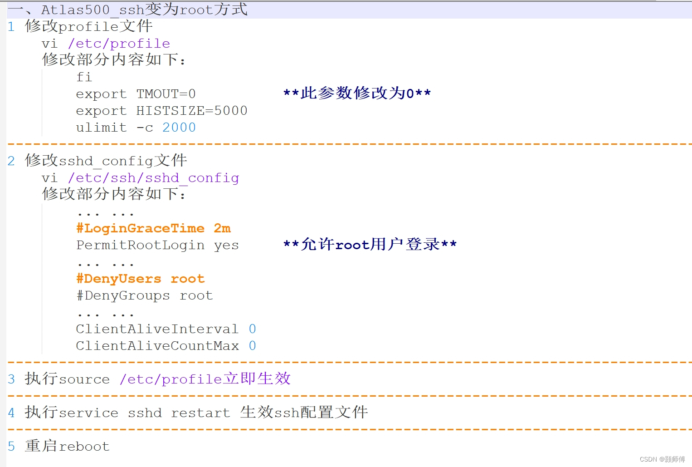

# 小站配置

## 首次配置

1. 路由器配置: 更改路由器DHCP为`192.168.2.[1 ~ 255]`
2. 网络连接：小站与路由器网线直连。小站网络端口1:`192.168.2.111`
3. 进入web后台： 同一局域网内存访问小站`192.168.2.111`。如果浏览器显示“此网站的安全证书有问题”，请单击“继续浏览此网站”

4. 输入用户名和密码: 默认用户名`admin` 默认密码`Huawei12#$`
5. 在弹出的修改窗口中，输入原密码、新密码、确认密码并单击“确定”，完成用户密
码修改。
6. 在登录界面，再次输入用户名和新的密码。

### ssh配置

1. `ssh [usernmae]@192.168.2.111` 
2. 进入 `IES:`命令窗口
3. 在IES窗口输入`sftp enable`命令开启stfp。
4. 进入开发模式也是以root用户进入欧拉系统,在IES中输入`develop`命令，会提示输入密码，默认密码:`Huawei@SYS3`。第一次进入会提示修改密码。
5. 进入开发模式后开启**root用户登录**，**ssh有效时间配置**。配置如下



### sftp配置

1. 通过sftp客户端登录IES命令行界面。
2. 将本地的文件上传至Atlas 500 智能小站的`/tmp`目录下。

```sh

sftp root@192.168.2.111

put -r dir .
put file .
get file .
get -r dir .

```

- [SFTP文件传输基本命令](https://blog.csdn.net/Trance95/article/details/128735668)

### 网络配置

由于小站默认不开启外网访问，需要开启外网访问需要额外配置。

1. ssh root进入欧拉系统
2. 增加dns配置,往`/etc/resolv.conf`文件写入`nameserver 114.114.114.114`
3. 可能还需要增加网关配置 `route add default gw 192.168.2.1`

### 文件挂载配置

这里演示挂载自己的docker `data-root`目录。

1. 进入web管理后台 -> 管理 -> 磁盘
2. 点击**/dev/hdisk0**栏前的`v`展开目录，查看挂载磁盘位置
3. 点击后面的**创建分区**, 创建100G分区。没有出现新的分区，点击刷新。
4. ssh root进入远程命令窗口执行`/opt/middleware/MindXOM/bin/mount_white_path add /home/docker`命令，将挂载路径手动添加到白名单中
5. 在web管理后台，在刚创建好的分区点击挂载，挂载路径填写`/home/docker`

### docker环境配置

由于小站系统的内存很少，需要重新配置docker `data-root`目录。直接用上面创建的目录。

1. ssh root进入远程命令窗口。

2. 在`/etc/docker/daemon.json`增加`"data-root": "/home/docker"`配置。

3. `docker info | grep  "Docker Root Dir"` 查看配置是否生效。

## 参考手册

- [官方文档](https://support.huawei.com/enterprise/zh/doc/EDOC1100133176/426cffd9)

- [所有手册](https://support.huawei.com/enterprise/zh/ascend-computing/a500-3000-pid-250702836)

- [华为500小站预配置](https://blog.csdn.net/hh1357102/article/details/130169513)