# 部署 打包教程

- 需要在本地安装docker环境

## api服务器打包

1. 直接在idea中mvn运行package

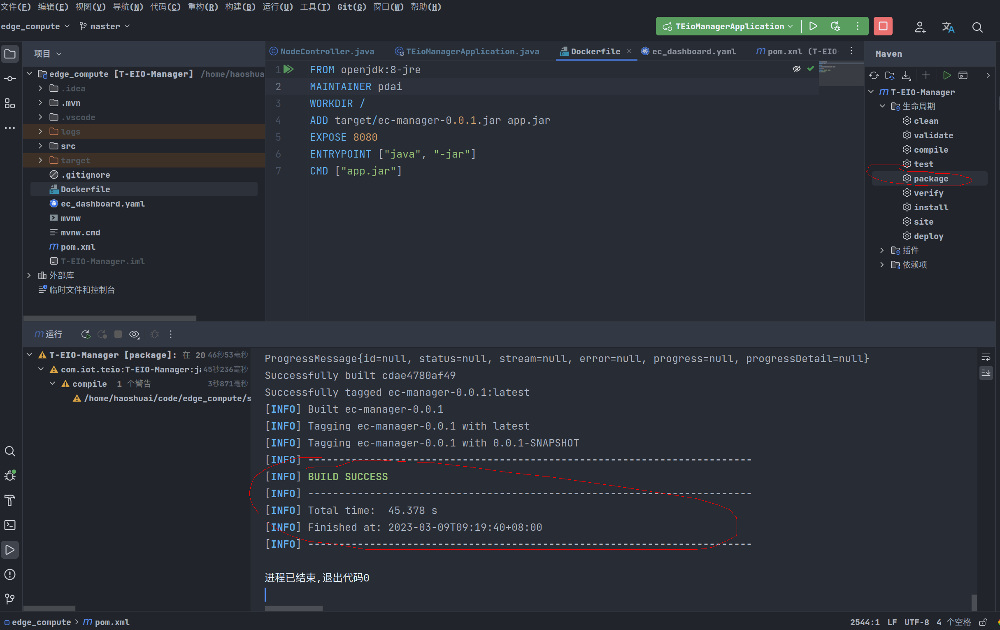

2. 在docker中查看是否运行成功

```sh
docker images
```

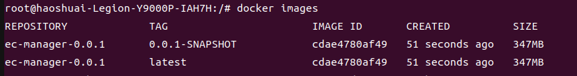

3. 镜像导出

```sh
docker save ec-manager-0.0.1:latest > ec-manager.tar
```

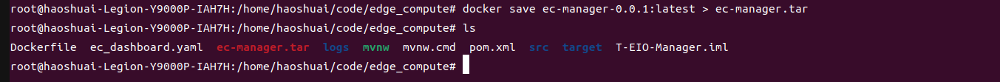


## web vue打包

1. 安装nodejs环境

```sh
apt install npm
```

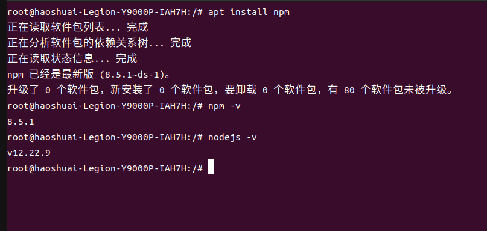

2. 安装web vue依赖

```sh
npm i
```
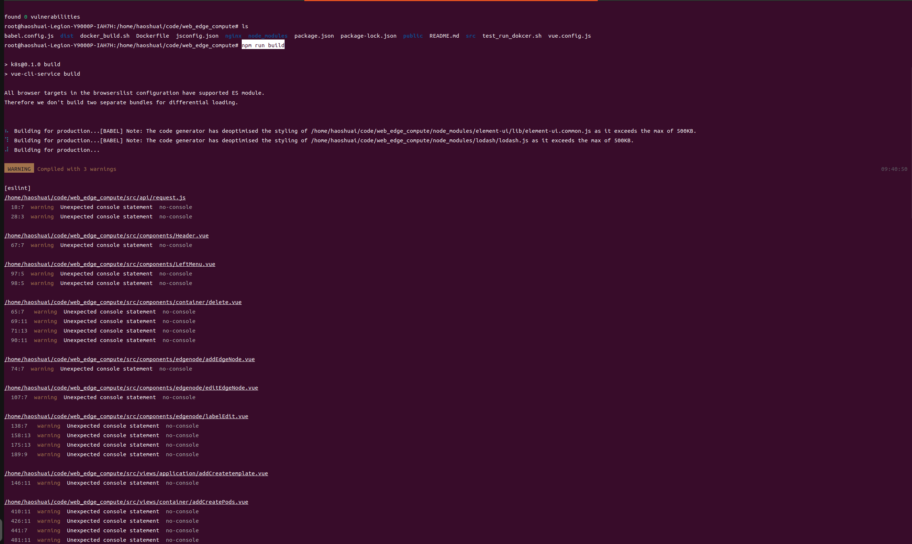
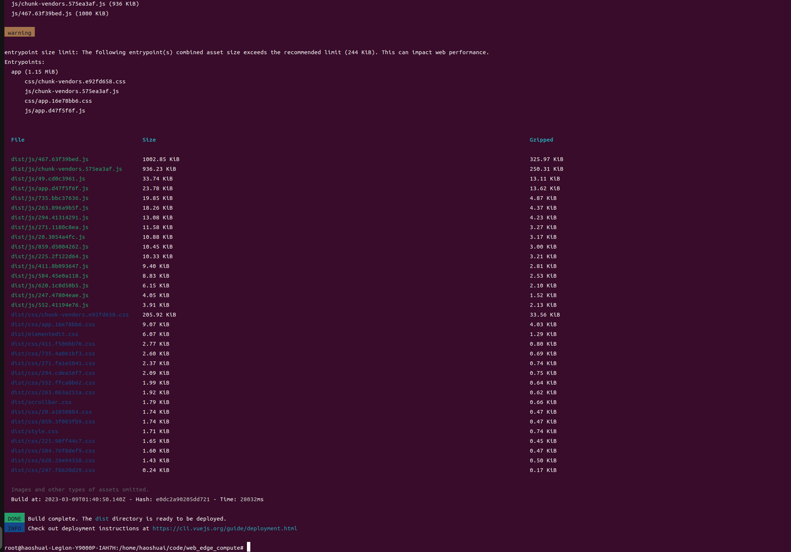

3. 执行vue打包

```sh
npm run build
```

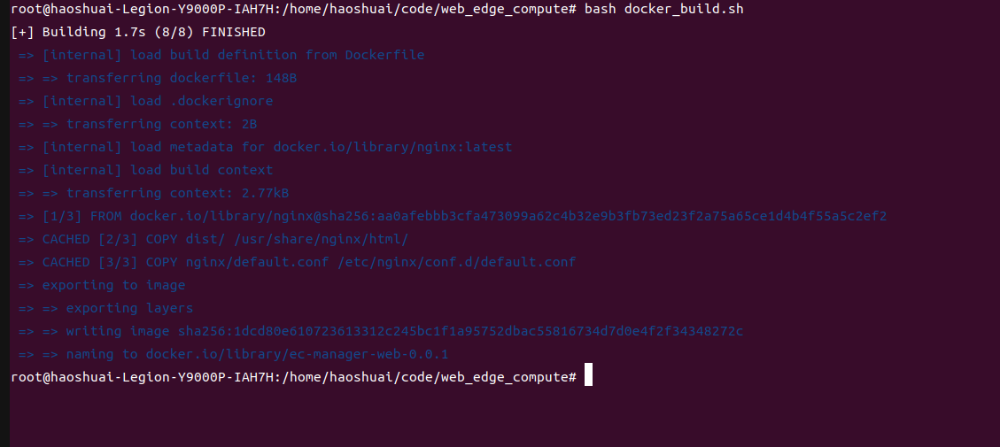

4. 执行生成docker

```sh
bash docker_build.sh
```

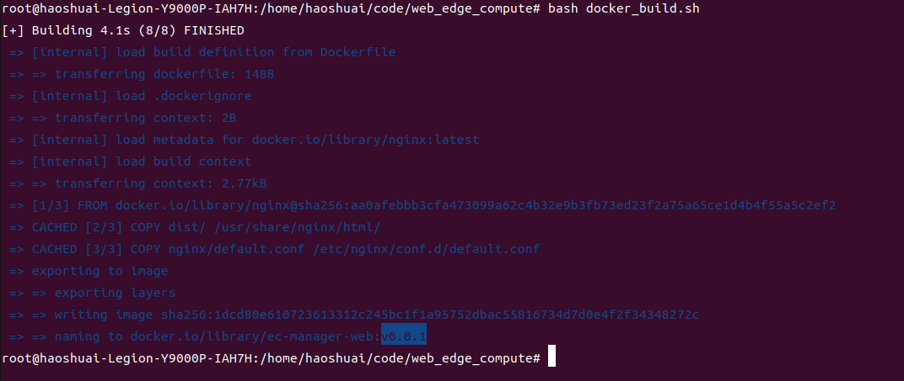

5. 镜像导出

```sh
docker save ec-manager-web:v0.0.1 > ec-manager-web.tar
```


## 部署教程

我这里部署到k8s-master03节点，此节点性能稍好。

k8s-master03的公网ip `119.23.231.199`

1. 给目标节点打上标签

```sh
# kubectl label node  [node name] [label key=value]
kubectl label node k8s-master03 ec-app=dashboard
```

2. 查看给打节点标签是否成功

```sh
kubectl get node k8s-master03 --show-labels
```

3. 配置镜像拉取配置

[参考教程](https://kubernetes.io/zh-cn/docs/tasks/configure-pod-container/pull-image-private-registry/)

```sh
kubectl create secret docker-registry [secret name] \
  --docker-server=<你的镜像仓库服务器> \
  --docker-username=<你的用户名> \
  --docker-password=<你的密码> \
  --docker-email=<你的邮箱地址>

kubectl create -ns ec-dashboard

kubectl create secret docker-registry harbor01 -n ec-dashboard \
  --docker-server=119.23.231.199 \
  --docker-username=admin \
  --docker-password="Pass01:)."
```


- 部署yaml配置文件

```yaml
apiVersion: v1
kind: Namespace
metadata:
  name: ec-dashboard

---

apiVersion: v1
kind: ServiceAccount
metadata:
  name: harbor
  namespace: ec-dashboard
imagePullSecrets:
- name: harbor-secret

---

kind: Service
apiVersion: v1
metadata:
  labels:
    k8s-app: ec-dashboard
  name: ec-dashboard
  namespace: ec-dashboard
spec:
  ports:
    - port: 8086
      targetPort: 8086
  selector:
    k8s-app: ec-dashboard
  type: NodePort

---

kind: Deployment
apiVersion: apps/v1
metadata:
  labels:
    k8s-app: ec-dashboard
  name: ec-dashboard
  namespace: ec-dashboard
spec:
  serviceAccount: harbor
  selector:
    matchLabels:
      k8s-app: ec-dashboard
  template:
    metadata:
      labels:
        k8s-app: ec-dashboard
    spec:
      nodeSelector:
        ec-app: dashboard
      containers:
        - name: ec-dashboard-manager
          image: 119.23.231.199/test/ec-manager:v0.0.5
          imagePullPolicy: IfNotPresent
          ports:
            - containerPort: 8080
              protocol: TCP
        - name: ec-dashboard-web
          image: 119.23.231.199/test/ec-manager-web:v0.0.5.1
          imagePullPolicy: IfNotPresent
          ports:
            - containerPort: 8086
              protocol: TCP
```

3. 导入之前生成的镜像

```sh
# 导入api镜像
docker load < ec-manager.tar
# 导入web镜像
docker load < ec-manager-web.tar

docker images
```

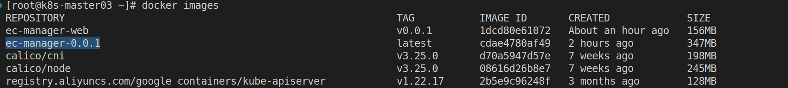

4. (启用用新的镜像需要执行此步骤) 删除之前已经成功应用

```sh
kubectl delete deployment ec-dashboard -nec-dashboard
```

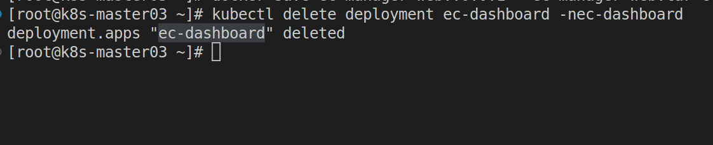

5. 执行部署文件

```sh
kubectl apply -f ec_de.yaml
```

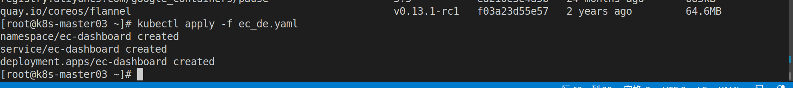

6. 查看是否成功部署

```sh
kubectl get deployments -nec-dashboard
kubectl get pods -nec-dashboard
kubectl get svc -nec-dashboard
```

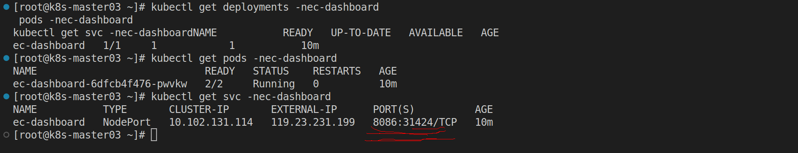

**注意上面**svc的端口

最后我们成功部署的访问地址是: http://119.23.231.199:31424

## 测试

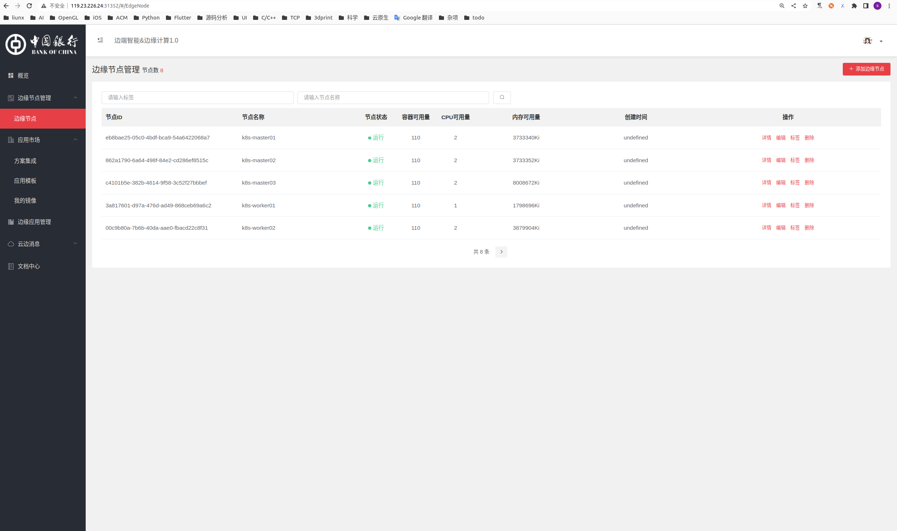
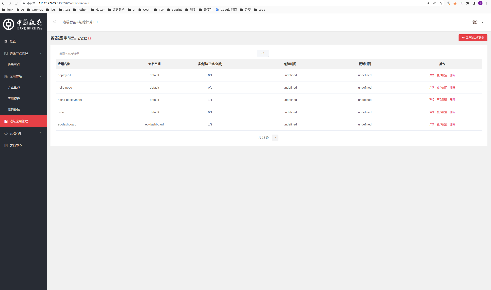