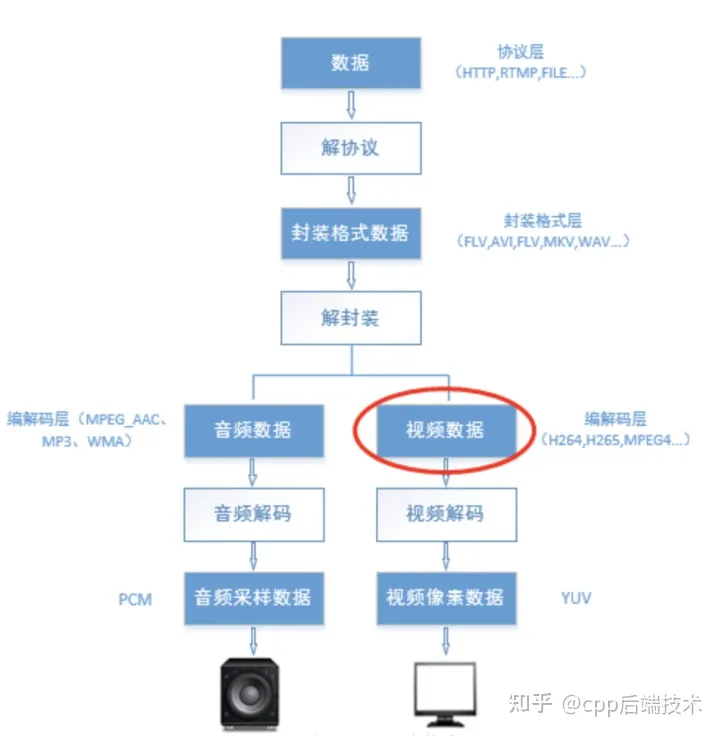
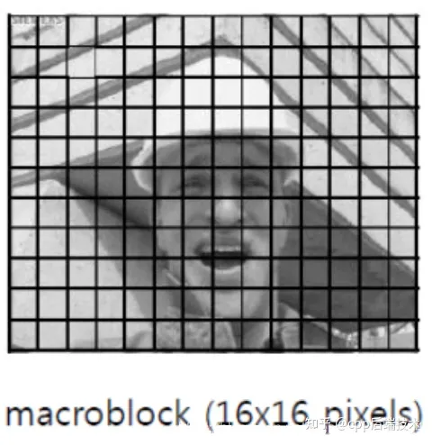
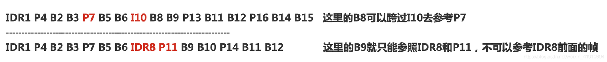
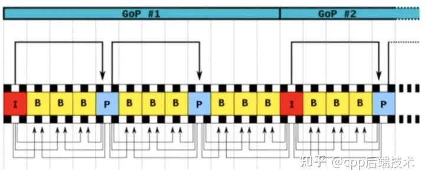

# H.264的主要目标

1、编码是为了将数据进行压缩，这样在传输的过程中就不会使资源被浪费。

2、用一个简单的例子来说明编码的必要性：当你此刻显示器正在播放一个视频，分辨率是1280*720，帧率是25，那么一秒所产生正常的数据大小为：1280*720(位像素)*25(张) / 8(1字节8位)(结果:B) / 1024(结果:KB) / 1024 (结果:MB) = 2.75MB。显然一秒这么大的数据你是无法接受的，需要将数据进行压缩。

3、H264在视频采集到输出中属于编解码层次的数据，如下图所示，是在采集数据后做编码压缩时通过编码标准编码后所呈现的数据。

4、对于视频⽂件来说，视频由单张图⽚帧所组成，⽐如每秒25帧，但是图⽚帧的像素块之间存在相似性，因此视频帧图像可以进⾏图像压缩；H264采⽤了16*16的分块⼤⼩对，视频帧图像进⾏相似⽐较和压缩编码。如下图所示：

## H264相关概念

### 序列

1. H264编码标准中所遵循的理论依据个人理解成：参照一段时间内相邻的图像中，像素、亮度与色温的差别很小。所以当面对一段时间内图像我们没必要去对每一幅图像进行完整一帧的编码，而是可以选取这段时间的第一帧图像作为完整编码，而下一幅图像可以记录与第一帧完整编码图像像素、亮度与色温等的差别即可，以此类推循环下去。
2. 什么叫序列呢？上述的这段时间内图像变化不大的图像集我们就可以称之为一个序列。序列可以理解为有相同特点的一段数据。但是如果某个图像与之前的图像变换很大，很难参考之前的帧来生成新的帧，那么就结束删一个序列，开始下一段序列。重复上一序列的做法，生成新的一段序列。

### 帧类型

- H264结构中，一个视频图像编码后的数据叫做一帧，一帧由一个片（slice）或多个片组成，一个片由一个或多个宏块（MB）组成，一个宏块由16x16的yuv数据组成。宏块作为H264编码的基本单位。

- H264使⽤帧内压缩和帧间压缩的⽅式提⾼编码压缩率；

- H264采⽤了独特的I帧、P帧和B帧策略来实现，连续帧之间的压缩；

**1. I帧**

I帧: 帧内编码帧 ，I帧表示关键帧，你可以理解为这一帧画面的完整保留；解码时只需要本帧数据就可以完成（因为包含完整画面）

> I帧特点:
>- 它是一个全帧压缩编码帧。它将全帧图像信息进行JPEG压缩编码及传输;
>- 解码时仅用I帧的数据就可重构完整图像;
>- I帧描述了图像背景和运动主体的详情;
>- I帧不需要参考其他画面而生成;
>- I帧是P帧和B帧的参考帧(其质量直接影响到同组中以后各帧的质量);
>- I帧不需要考虑运动矢量;
>- I帧所占数据的信息量比较大。

**2. P帧**

P帧:前向预测编码帧。P帧表示的是这一帧跟之前的一个关键帧（或P帧）的差别，解码时需要用之前缓存的画面叠加上本帧定义的差别，生成最终画面。（也就是差别帧，P帧没有完整画面数据，只有与前一帧的画面差别的数据）

P帧的预测与重构：P帧是以I帧为参考帧,在I帧中找出P帧“某点”的预测值和运动矢量,取预测差值和运动矢量一起传送。在接收端根据运动矢量从I帧中找出P帧“某点”的预测值并与差值相加以得到P帧“某点”样值,从而可得到完整的P帧。

> P帧特点:
>- P帧是I帧后面相隔1~2帧的编码帧;
>- P帧采用运动补偿的方法传送它与前面的I或P帧的差值及运动矢量(预测误差);
>- 解码时必须将I帧中的预测值与预测误差求和后才能重构完整的P帧图像;
>- P帧属于前向预测的帧间编码。它只参考前面最靠近它的I帧或P帧;
>- P帧可以是其后面P帧的参考帧,也可以是其前后的B帧的参考帧;
>- 由于P帧是参考帧,它可能造成解码错误的扩散;
>- 由于是差值传送,P帧的压缩比较高

**3. B帧**

B帧：双向预测内插编码帧。B帧是双向差别帧，也就是B帧记录的是本帧与前后帧的差别（具体比较复杂，有4种情况），换言之，要解码B帧，不仅要取得之前的缓存画面，还要解码之后的画面，通过前后画面的与本帧数据的叠加取得最终的画面。B帧压缩率高，但是解码时CPU会比较累。

B帧以前面的I或P帧和后面的P帧为参考帧,“找出”B帧“某点”的预测值和两个运动矢量,并取预测差值和运动矢量传送。接收端根据运动矢量在两个参考帧中“找出(算出)”预测值并与差值求和,得到B帧“某点”样值,从而可得到完整的B帧。

> B帧特点:
>- B帧是由前面的I或P帧和后面的P帧来进行预测的;
>- B帧传送的是它与前面的I或P帧和后面的P帧之间的预测误差及运动矢量;
>- B帧是双向预测编码帧;
>- B帧压缩比最高,因为它只反映两个参考帧间运动主体的变化情况,预测比较准确;
>- B帧不是参考帧,不会造成解码错误的扩散。

**4. GOP(画面组)**

- GOP即Group of picture（图像组），指两个I帧之间的距离(下图所说的视频序列就是GOP)，Reference（参考周期）指两个P帧之间的距离，可以理解为跟序列差不多意思，就是一段时间内变化不大的图像集，比较说GOP为120,如果是720 p60 的话,那就是2s一次I帧。一个I帧所占用的字节数大于一个P帧，一个P帧所占用的字节数大于一个B帧。所以在码率不变的前提下，GOP值越大，P、B帧的数量会越多，平均每个I、P、B帧所占用的字节数就越多，也就更容易获取较好的图像质量；Reference越大，B帧的数量越多，同理也更容易获得较好的图像质量。

- GOP结构一般有两个数字，如M=3，N=12。M指定I帧和P帧之间的距离，N指定两个I帧之间的距离。上面的M=3，N=12，GOP结构为：IBBPBBPBBPBBI。在一个GOP内I frame解码不依赖任何的其它帧，p frame解码则依赖前面的I frame或P frame，B frame解码依赖前最近的一个I frame或P frame 及其后最近的一个P frame。

**6. IDR帧(关键帧)**

1、IDR（Instantaneous Decoding Refresh）即时解码刷新。 在编码解码中为了方便，将GOP中首个I帧要和其他I帧区别开，把第一个I帧叫IDR，这样方便控制编码和解码流程，所以IDR帧一定是I帧，但I帧不一定是IDR帧；IDR帧的作用是立刻刷新,使错误不致传播,从IDR帧开始算新的序列开始编码。I帧有被跨帧参考的可能,IDR不会。

2、I帧不用参考任何帧，但是之后的P帧和B帧是有可能参考这个I帧之前的帧的。IDR就不允许这样，例如：

3、其核⼼作⽤是，是为了解码的重同步，当解码器解码到 IDR 图像时，⽴即将参考帧队列清空，将已解码的数据全部输出或抛弃，重新查找参数集，开始⼀个新的序列。这样，如果前⼀个序列出现重⼤错误，在这⾥可以获得重新同步的机会。IDR图像之后的图像永远不会使⽤IDR之前的图像的数据来解码。

