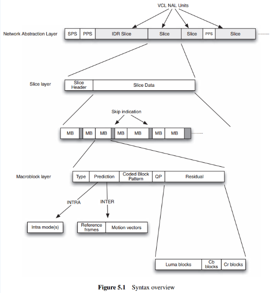

# 视频基础 

https://www.cnblogs.com/ssyfj/p/14671862.html

https://www.cnblogs.com/ssyfj/p/14676355.html

https://www.cnblogs.com/ssyfj/p/14624498.html

https://zhuanlan.zhihu.com/p/605149388?utm_id=0

## H264在概念上分为两层：

- VCL：视频编码层，负责高效的内容表示。
- NAL：网络提取层，负责以网络所要求的恰当的方式对数据进行打包和传送。

VCL Layer 將 vidoe image(one image) 分割為許多的 slices，這此slice在分成許多的NALU傳送出去

VCL 数据即编码处理的输出，它表示被压缩编码后的视频数据序列。在 VCL 数据传输或存储之前，这些编码的 VCL 数据，先被映射或封装进 NAL 单元中。

每个 NAL 单元包括一个原始字节序列负荷（RBSP）、一组对应于视频编码数据的 NAL 头信息。

切片头：


H.264从层次来看分为两层：视频编码层（VCL， Video Coding Layer）和网络提取层（NAL，Network Abstraction Layer）。VCL输出的是原始数据比特流（SODB，String of data bits），表示H.264的语法元素编码完成后的实际的原始二进制码流。



### 264的两种码流格式，它们分别为：字节流格式和RTP包格式。

- 字节流格式：这是在h264官方协议文档中规定的格式，所以它也成为了大多数编码器，默认的输出格式。它的基本数据单位为NAL单元，也即NALU。
- RTP包格式：在这种格式中，NALU并不需要起始码Start_Code来进行识别，而是在NALU开始的若干字节（1，2，4字节），代表NALU的长度。


H.264码流的结构如下：


## NALU: 

NALU是将每一帧数据写入到一个NALU单元中，进行传输或存储的NALU设计的目的，是根据不同的网络把数据打包成相应的格式，将VCL产生的比特字符串适配到各种各样的网络和多元环境中。

NALU是将每一帧数据写入到一个NALU单元中，进行传输或存储的。
NALU的封装方式：NALU分为NALU头和NALU体


## 字节流格式和RTP格式

> 多个NALU数据组合在一起形成总的输出码流。对于不同的应用场景，NAL规定了一种通用的格式适应不同的传输封装类型。

- 字节流格式
大多数编码器实现的默认输出格式。字节流格式以连续的bit字节形式传输码流。

- RTP包格式
包格式将NALU按照RTP数据包的格式封装。因此不需要像流传输那样分割识别码，并且很好解包，但是封装格式并没有在标准协议文档中明确规定，仅此使用起来会有一定风险。

## 片(slice)

每帧图片中都含有多个切片，他们承载这多个宏块数据。片是H264中提出的新概念，在编码图片后切分并整合出来的一个概念。
片之所以被创造出来，主要目的是为限制误码的扩散和传输。使编码片相互间是独立的。某片的预测不能以其他片中的宏块为参考图像，这样某一片中的预测误差才不会传播到其他片中。
片又分为：切片头和切片数据
类型：

- I片：只包含I宏块
- P片：包含P和I宏块
- B片：包含B和I宏块
- SP片：包含P 和/或 I宏块,用于不同码流之间的切换
- SI片：一种特殊类型的编码宏块


## 宏块(macroblock)和子块

H264默认是使用16x16大小的区域作为一个宏块。
宏块是视频信息的主要承载者。也就是我们最想知道的图片信息(YUV格式)。一个编码图像通常划分为多个宏块组成。

如果需要更高的压缩率，还可以在宏块的基础上划出更小的子块。如：16x8、8x16、8x8、.. 4x4。


## pts/dts

- PTS(Presentation Time Stamp)：PTS 主要用于度量解码后的视频帧什么时候被显示出来。
- DTS(Decode Time Stamp)：DTS 主要是标识内存中的 bit 流什么时候开始送入解码器中进行解码。


DTS 与 PTS 的不同：
DTS 主要用户视频的解码，在解码阶段使用。PTS主要用于视频的同步和输出，在 display 的时候使用。再没有 B frame 的时候输出顺序是一样的。


## H.264 码流分层

**VCL & NAL**


H.264 的功能分为两层，即视频编码层（VCL）和网络提取层（NAL，Network AbstractionLayer）。

**VCL Layer** 將 vidoe image 分割為許多的 slices，這此slice在分成許多的NALU傳送出去

**VCL** 数据即编码处理的输出，它表示被压缩编码后的视频数据序列。在VCL 数据传输或存储之前，这些编码的 VCL 数据，先被映射或封装进 NAL 单元中。

每个 NAL 单元包括一个原始字节序列负荷（RBSP）、一组对应于视频编码数据的 NAL 头信息。

切片头：包含了一组片的信息，比如片的数量，顺序等等


**VCL**输出的是原始数据比特流（SODB，String of data bits），表示H.264的语法元素编码完成后的实际的原始二进制码流。

SODB通常不能保证字节对齐,故需要补齐为原始字节序列负荷（RBSP，Raw Byte Sequence Payload）。NAL层实际上就是最终输出的H.264码流，它是由一个个NALU组成的，每个NALU包括一组对应于视频编码数据的NAL头信息和一个原始字节序列负荷（RBSP，Raw Byte Sequence Payload）。以上名词之间的关系如下：


```c
RBSP = SODB + RBSP trailing bits
NALU = NAL header(1 byte) + RBSP
H.264 = Start Code Prefix(3 bytes) + NALU + Start Code Prefix(3 bytes) + NALU +…
```


NALU (Nal Unit) = NALU头 + RBSP 在 VCL

数据传输或存储之前，这些编码的 VCL 数据，先被映射或封装进 NAL 单元(以下简称 NALU，Nal Unit) 中。每个 NALU 包括一个原始字节序列负荷(RBSP, Raw Byte Sequence Payload)、一组 对应于视频编码的 NALU 头部信息。RBSP 的基本结构是:在原始编码数据的后面填加了结尾 比特。一个 bit“1”若干比特“0”，以便字节对齐。

一个原始的 H.264 NALU 单元常由 [StartCode] [NALU Header] [NALU Payload] 三部分组成。

StartCode : Start Code 用于标示这是一个NALU 单元的开始，必须是”00 00 00 01” 或”00 00 01”（Annex B码流格式才必须是”00 00 00 01” 或”00 00 01”）