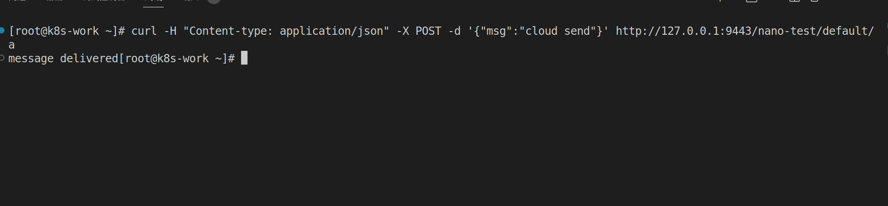
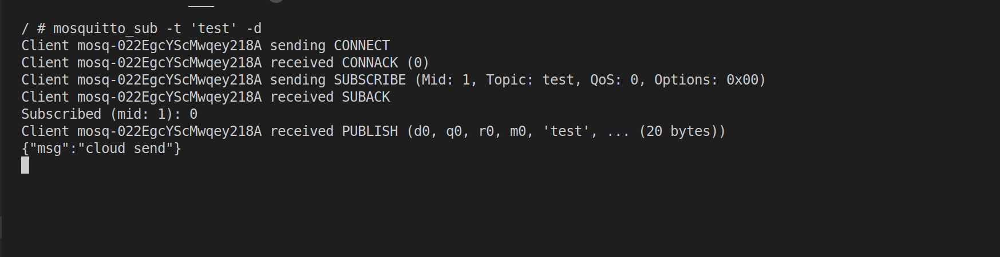
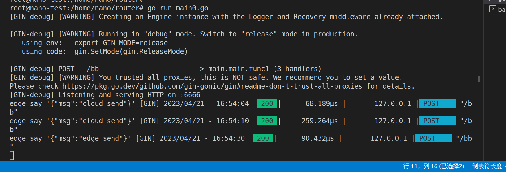
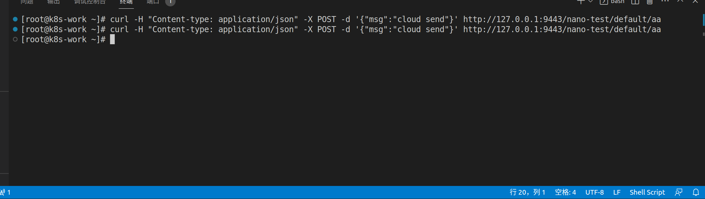
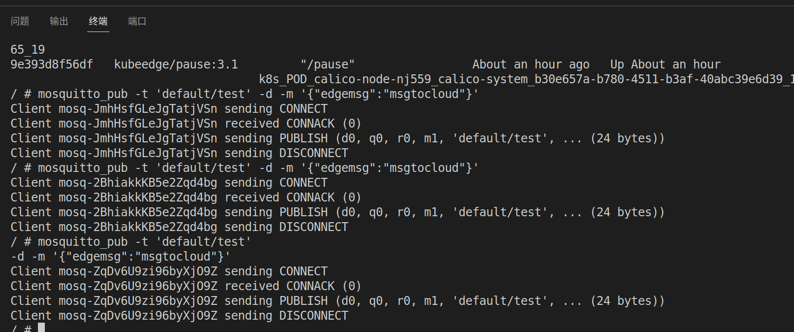
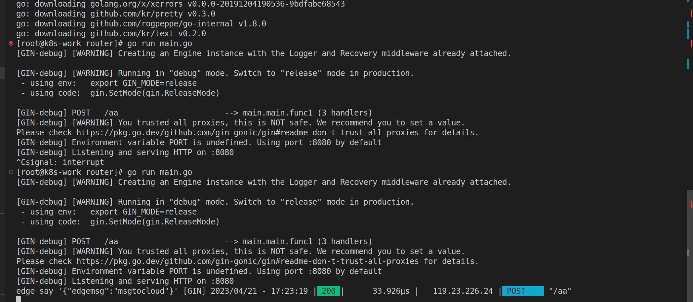

# kubedge Router 测试教程

## cloud to edge : rest->eventbus

```yaml

apiVersion: rules.kubeedge.io/v1
kind: RuleEndpoint
metadata:
  name: my-rest
  labels:
    description: test
spec:
  ruleEndpointType: "rest"
  properties: {}

--- 

apiVersion: rules.kubeedge.io/v1
kind: RuleEndpoint
metadata:
  name: my-eventbus
  labels:
    description: test
spec:
  ruleEndpointType: "eventbus"
  properties: {}

---

apiVersion: rules.kubeedge.io/v1
kind: Rule
metadata:
  name: my-rule
  labels:
    description: test
spec:
  source: "my-rest"
  sourceResource: {"path":"/a"}
  target: "my-eventbus"
  targetResource: {"topic":"test"}

```

```sh
kubectl create -f create-rule-rest-eventbus.yaml
```

### 测试


**edge**

先在边缘端进行消息的订阅

```sh
# 进入到mqtt 容器中
docker exec -it b2f73d901244 sh

# 在容器中进行订阅
mosquitto_sub -t 'test' -d 

```

**cloud**

```sh
# http://{rest_endpoint}/{node_name}/{namespace}/{path}
# 9443 端口号是 cloud 默认开启的端口号，在 cloudcore configmap 中有定义
curl -H "Content-type: application/json" -X POST -d '{"msg":"cloud send"}' http://127.0.0.1:9443/nano-test/default/a
```






## edge to cloud ： eventbus->rest

create-rule-eventbus-rest.yaml

```yaml

apiVersion: rules.kubeedge.io/v1
kind: RuleEndpoint
metadata:
  name: my-rest
  labels:
    description: test
spec:
  ruleEndpointType: "rest"
  properties: {}

---

apiVersion: rules.kubeedge.io/v1
kind: RuleEndpoint
metadata:
  name: my-eventbus
  labels:
    description: test
spec:
  ruleEndpointType: "eventbus"
  properties: {}

---

apiVersion: rules.kubeedge.io/v1
kind: Rule
metadata:
  name: my-rule-eventbus-rest
  labels:
    description: test
spec:
  source: "my-eventbus"
  sourceResource: {"topic": "test","node_name": "node-test"}
  target: "my-rest"
  targetResource: {"resource":"http://112.74.52.83:8080/aa"}

```

### 创建资源

```sh
kubectl create -f create-rule-rest-eventbus.yaml
```

### 测试


**cloud core**

先在云端启动一个监听8080端口的http服务。端口号是上面 resource 定义的，以及监听路经。

```go
package main

import (
	"fmt"
	"github.com/gin-gonic/gin"
	"io/ioutil"
)

func main() {
	r := gin.Default()
	r.POST("/aa", func(c *gin.Context) {
		s, _ := ioutil.ReadAll(c.Request.Body)
		fmt.Printf("edge say '%s' ", s)
	})
	r.Run(":8080")
}
```

```sh

# 运行一个http服务 

go mod init test
# 换国内的源比较快
go mod tidy
# 运行服务
go run main.go

```


**edge core**

边缘端进入到mosquitto容器中 进行一个mqtt的消息推送

```sh

# 进入到mqtt 容器中
docker exec -it b2f73d901244 sh

mosquitto_pub -t 'default/test' -d -m '{"edgemsg":"msgtocloud"}'

```






## cloud to edge : rest->servicebus

```yaml

apiVersion: rules.kubeedge.io/v1
kind: RuleEndpoint
metadata:
  name: my-rest
  labels:
    description: test
spec:
  ruleEndpointType: "rest"
  properties: {}

---

apiVersion: rules.kubeedge.io/v1
kind: RuleEndpoint
metadata:
  name: my-servicebus
  labels:
    description: test
spec:
  ruleEndpointType: "servicebus"
  properties: {"service_port":"6666"}

--- 

apiVersion: rules.kubeedge.io/v1
kind: Rule
metadata:
  name: my-rule-rest-servicebus
  labels:
    description: test
spec:
  source: "my-rest"
  sourceResource: {"path":"/aa"}
  target: "my-servicebus"
  targetResource: {"path":"/bb"}

```

### 测试


**edge**

在边缘端启用一个http服务，监听6666端口号，端口号在上面中有定义。

```go
package main

import (
	"github.com/gin-gonic/gin"
	"fmt"
	"io/ioutil"
)

func main() {
	r := gin.Default()
    r.POST("/bb", func(c *gin.Context) {
		s, _ := ioutil.ReadAll(c.Request.Body)
		fmt.Printf("edge say '%s' ", s)
	})
	r.Run(":6666")
}
```

```sh
go mod init test
# 换国内的源比较快
go mod tidy
# 运行服务
go run main.go
```

**cloud**

云端发送一个http请求，端口号是cloud core 默认定义的。
endpoint: http://127.0.0.1:9443/{node name}/{namespace}/{path}

```sh

curl -H "Content-type: application/json" -X POST -d '{"msg":"cloud send"}' http://127.0.0.1:9443/nano-test/default/aa

curl -H "Content-type: application/json" -X POST -d '{"msg":"pc info cloud send"}' http://119.23.226.24:9443/nano-test/default/aa

```




