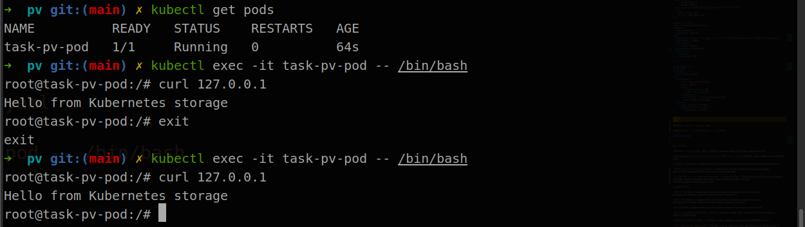

# K8S的PV,PVC持久存储方案

**持久卷（PersistentVolume，PV）** 是集群中的一块存储，可以由管理员事先制备， 或者使用存储类（Storage Class）来动态制备。 持久卷是集群资源，就像节点也是集群资源一样。PV 持久卷和普通的 Volume 一样， 也是使用卷插件来实现的，只是它们拥有独立于任何使用 PV 的 Pod 的生命周期。 此 API 对象中记述了存储的实现细节，无论其背后是 NFS、iSCSI 还是特定于云平台的存储系统。

**持久卷申领（PersistentVolumeClaim，PVC）** 表达的是用户对存储的请求。概念上与 Pod 类似。 Pod 会耗用节点资源，而 PVC 申领会耗用 PV 资源。Pod 可以请求特定数量的资源（CPU 和内存）；同样 PVC 申领也可以请求特定的大小和访问模式 （例如，可以要求 PV 卷能够以 ReadWriteOnce、ReadOnlyMany 或 ReadWriteMany 模式之一来挂载，参见访问模式）。

## 部署流程

### 搭建NFS文件服务器

[service-nfs](https://ubuntu.com/server/docs/service-nfs)

```sh
sudo apt update

sudo apt upgrade

sudo apt install nfs-kernel-server

sudo systemctl start nfs-kernel-server.service

sudo mkdir /nfs_share

# 打开nfs服务器配置文件/etc/exports，指定nfs服务器共享目录及其属性
sudo vi /etc/exports
/nfs_share  *(rw,sync,no_subtree_check)

# /nfs_share：指定/nfs_share为nfs服务器的共享目录
# *：允许所有的网段访问，也可以使用具体的IP
# rw：挂接此目录的客户端对该共享目录具有读写权限
# sync：资料同步写入内存和硬盘
# no_root_squash：root用户具有对根目录的完全管理访问权限
# no_subtree_check：不检查父目录的权限

sudo exportfs -a

showmount -e localhost
```

### PV,PVC 配置

```sh
cd /nfs_share

# 这里再次假定你的节点使用 "sudo" 来以超级用户角色执行命令
sudo sh -c "echo 'Hello from Kubernetes storage' > /nfs_share/index.html"

cat /nfs_share/index.html

```

```yaml

apiVersion: v1
kind: PersistentVolume
metadata:
  name: pv0000
  #namespace: default 没有命名空间限制
spec:
  storageClassName: ""
  claimRef:
    name: pvc0000
    namespace: default
  capacity:
    storage: 10Gi
  volumeMode: Filesystem
  accessModes: # 访问模式
    - ReadWriteOnce
    - ReadWriteMany
  persistentVolumeReclaimPolicy: Recycle # 回收策略
  nfs:
    path: /nfs_share/test
    server: 192.168.8.54
---

apiVersion: v1
kind: PersistentVolumeClaim
metadata:
  name: pvc0000
  namespace: default
spec:
  storageClassName: "" # 此处须显式设置空字符串，否则会被设置为默认的 StorageClass
  volumeName: pv0000
  accessModes: # 访问模式
    - ReadWriteMany
  volumeMode: Filesystem
  resources:
    requests:
      storage: 1Gi

---

apiVersion: v1
kind: Pod
metadata:
  name: task-pv-pod
spec:
  containers:
    - name: task-pv-container
      image: nginx
      ports:
        - containerPort: 80
          name: "http-server"
      volumeMounts:
      - mountPath: "/usr/share/nginx/html"
        name: task-pv-storage
  volumes:
    - name: task-pv-storage
      persistentVolumeClaim:
        claimName: pvc0000
```

- **测试**

```sh

kubectl create -f pod_pv.yaml

kubectl exec -it task-pv-pod -- /bin/bash

curl 127.0.0.1

```





## 参考地址

- [Network File System (NFS)](https://ubuntu.com/server/docs/service-nfs)

- [Ubuntu最新版本(Ubuntu22.04LTS)安装nfs服务器及使用教程](http://www.xbhp.cn/news/34376.html)

- [持久卷](https://kubernetes.io/zh-cn/docs/concepts/storage/persistent-volumes/)

- [预留 PersistentVolume](https://kubernetes.io/zh-cn/docs/concepts/storage/persistent-volumes/#reserving-a-persistentvolume)

- [配置 Pod 以使用 PersistentVolume 作为存储](https://kubernetes.io/zh-cn/docs/tasks/configure-pod-container/configure-persistent-volume-storage/#create-a-persistentvolumeclaim)

- [PV API](https://kubernetes.io/zh-cn/docs/reference/kubernetes-api/config-and-storage-resources/persistent-volume-v1/)

- [PVC API](https://kubernetes.io/zh-cn/docs/reference/kubernetes-api/config-and-storage-resources/persistent-volume-claim-v1/)

- [PV NFS](https://kubernetes.io/zh-cn/docs/concepts/storage/volumes/#nfs)

- [k8s volume存储卷、PV、PVC和存储类](https://blog.csdn.net/martinlinux/article/details/125357320)

- [K8s存储卷、pv和pvc的使用](https://www.cnblogs.com/wjoyxt/p/10059316.html)

- [k8s 如何关联pvc到特定的pv?](https://blog.csdn.net/qianggezhishen/article/details/80764378)