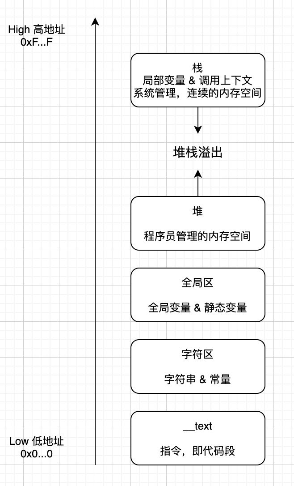
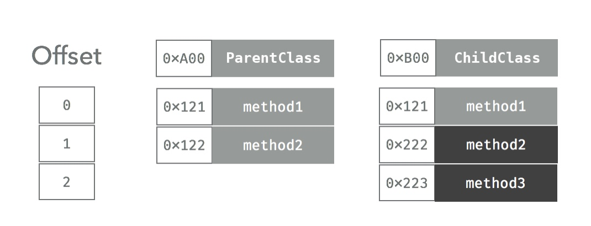
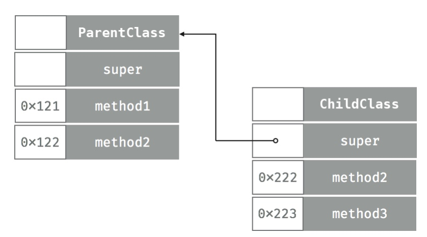
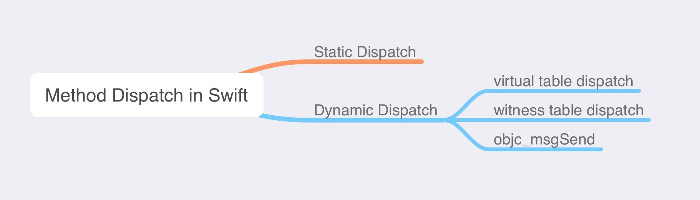
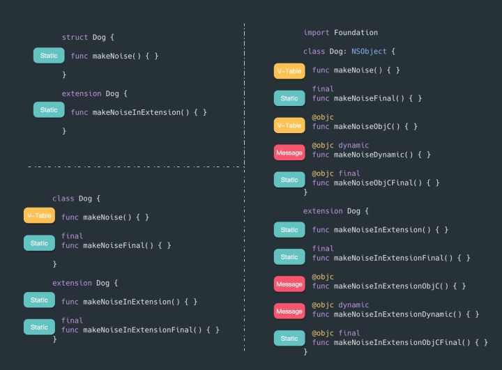
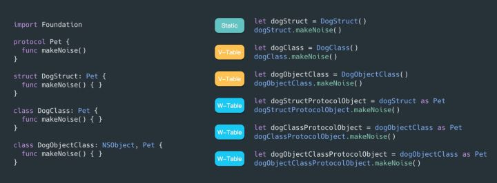

# Swift

**源码编译过程**

[参考链接](https://trinhngocthuyen.github.io/posts/tech/how-a-swift-file-is-compiled/)

- struct只是值类型的一种，除此之外还有enum、元组都是值类型。
- 值类型在内存中直接保存具体的值（特别长的字符串除外）。相互赋值也只是对值进行拷贝（深拷贝）。
- Swift中对值类型增加**写时拷贝**的特点；赋值后只有只发生变化才会真正的进行拷贝，变化前会保存旧值的指针，这也是一种对内存的优化方案。
- 可以通俗理解为：值类型相当于是一份文件，相互转发之后，人手一份，任何修改都互不干扰。
- 保存在栈区，无需处理引用计数

## Swift中的函数调用

在了解Swift发布调用机制之前，先来了解下swift方法是如何保存的。

在swift中所有数据类型的只有两种：值类型,引用类型。

值类型 : 在内存中直接保存值，没有引用计数；

引用类型 : 保存指针地址，在堆中分配内存

编程语言 函数调用机制有三种：

- 直接调用
- 函数表调用
- 消息派发机制调用

函数调用机制是程序判断使用哪种途径去调用一个函数的机制，每次函数调用时都会被触发。
了解函数的调用机制，对于写出高性能代码来说十分有必要。
Java:默认*函数表调用*，可以通过final修饰修改成 直接派发。
C++：默认是*直接调用*，但可以通过virtual修饰符来改成 函数表派发
Objective-C：总是使用*消息派发的机制*，但允许开发者使用C*直接派发*来获取性能的提高。

**Swift 函数调用机制，以上 三种都会涉及到。**

调用方式：（Types of Dispatch）

程序派发的目的是为了告诉CPU需要被调用的函数在哪里。在我们深入理解Swift派发机制之前，先来了解下这三种派发机制，以及没中方式在动态性和性能之间的取舍。

**直接调用：**

直接派发是最快的，函数位置确定,调用需要的指令集少，并且编译器还有很大的优化空间（比如：函数内联）。直接派发也称为静态调用。
然而，对于编程来说直接调用也是最大的局限，而且因为缺乏动态性所以没办法支持继承。

**函数表调用:**

函数表派发是编译型语言实现动态行为最常见的实现方式。函数表使用了一个数组来储存类声明的每一个函数的指针。大部分语言把这个称为『virtual table』*虚函数表*，Swift里称为 『witness table』。每一个类都会维护一个虚函数表，里边记录着当前类的所有函数，如果子类重写父类的方法， 表里只会保存override之后的函数地址，子类新增后会被插到这个数组的最后，运行时会根据这一个表决定实际要被调用的函数。
当一个函数调用时，首先要读取当前类的函数表，在读取函数对应的索引，然后跳转。

**消息派发机制调用:**
消息机制是调用函数的最动态的方式，也是Cocoa的基础，这样的机制催生了KVO、UIAppearence、CoreData等功能，这种运作方式的关键在于开发者可以在运行时改变函数的行为，不止可以通过swizzling 来改变，还可以用 isa-swizzling修改对象的继承关系，可以在面向对象的基础上实现自定义派发。

| typle | Struct & Enmu | Class |
| ---- | ---- | ---- |
| 普通方法 | 直接调用 | 直接调用 |
| protocol协议 | 直接调用| 函数表调用 |
| extension拓展 | 直接调用 | 直接调用 |
| final | - |直接调用 |
| 继承方法 | - | 函数表调用 |
| @objc | - | Swift调用Swift为函数表调用 ，OC调用Swift为消息转发 |
| dynamic | - | 函数表调用 |
| @objc dynamic | - |objc_msgSend消息转发 |

**struct, class , nsobject**

**protocol**

